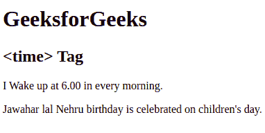

# HTML time Tag

> 原文：[https://www.geeksforgeeks.org/html-time-tag/](https://www.geeksforgeeks.org/html-time-tag/)

The <time> tag is used to display the human-readable date/time. It can also be used to encode dates and times in a machine-readable form. The main advantage for users is that they can offer to add birthday reminders or scheduled events in their calendar’s and search engines can produce smarter search results.

**Syntax:** 

```html
<time attribute> Time... </time>
```

**Attributes:** This tag contains a single attribute [*datetime*](https://www.geeksforgeeks.org/html-time-datetime-attribute/) which is used to define the date/time in a machine-readable form of the <time> element.
**Example:** 

## HTML

```html
<!DOCTYPE html>
<html>
    <body>
        <h1>GeeksforGeeks</h1>
        <h2><time> Tag</h2>

<p>I Wake up at <time>6.00</time> in every morning.</p>

<p>Jawahar lal Nehru birthday is celebrated on
        <time datatime="2018--11-14 12:00">children's day.</time>
        </p>

    </body>
</html>
```

**Output:** 



**Supported Browsers:**

*   Google Chrome 6.0 and above
*   Internet Explorer 9.0 and above
*   Firefox 4.0 and above
*   Opera 11.1 and above
*   Safari 5.0 and above