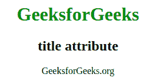
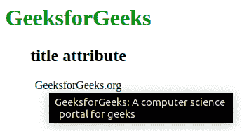

# HTML |标题属性

> 原文:[https://www.geeksforgeeks.org/html-title-attribute/](https://www.geeksforgeeks.org/html-title-attribute/)

title 属性用于指定关于元素的额外信息。当鼠标在元素上移动时，它显示信息。
**支持的标签:支持所有 HTML 元素。**

**语法:**

```html
<element title = "text">
```

**属性值:**该属性包含单值*文本*，用作元素的工具提示文本。这个标题与所有的 HTML 元素相关联。
**例:**

## 超文本标记语言

```html
<!DOCTYPE html>
<html>

<head>
    <title>title attribute</title>
    <style>
        body {
            text-align: center;
        }

        h1 {
            color: green;
        }
    </style>
</head>

<body>
    <h1>GeeksforGeeks</h1>
    <h2>title attribute</h2>

    <p title="GeeksforGeeks: A computer science
        portal for geeks">
      GeeksforGeeks.org
    </p>

</body>

</html>
```

**输出:**
鼠标悬停前:



鼠标悬停后:



**支持的浏览器:**标题属性支持的浏览器如下:

*   铬
*   微软公司出品的 web 浏览器
*   火狐浏览器
*   歌剧
*   旅行队