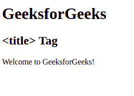

# HTML 标题标签

> 原文:[https://www.geeksforgeeks.org/html-title-tag/](https://www.geeksforgeeks.org/html-title-tag/)

HTML 中的<title>标签用于定义 HTML 文档的标题。它在浏览器工具栏中设置标题。当网页被添加到收藏夹时，它为网页提供标题。它在搜索引擎结果中显示页面的标题。<br/> <strong>语法:</strong> <br/></title>

```html
<title> Title name </title>
```

**例:**

## 超文本标记语言

```html
<!DOCTYPE html>
<html>
    <head>
        <title>title Tag</title>
    </head>
    <body>
        <h1>GeeksforGeeks</h1>
        <h2><title> Tag</h2>

<p>Welcome to GeeksforGeeks!</p>

    </body>
</html>                   
```

**输出:**



**支持的浏览器:**

*   谷歌 Chrome
*   微软公司出品的 web 浏览器
*   火狐浏览器
*   歌剧
*   旅行队