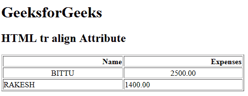

# HTML | tr align Attribute

> 原文：[https://www.geeksforgeeks.org/html-tr-align-attribute/](https://www.geeksforgeeks.org/html-tr-align-attribute/)

The **HTML <tr> align Attribute** is used to *set the horizontal alignment of text content inside the table row*. It is not supported by HTML 5.

**Syntax:**

```html
<tr align= "left | right | center | justify | char">
```

**Attribute Values:**

*   **left:** It sets the text left-align.
*   **right:** It sets the text right-align.
*   **center:** It sets the text center-align.
*   **justify:** It stretches the text of paragraph to set the width of all lines equal.
*   **char:** It sets the text-align to a specific character.

**Example:**

```html
<!DOCTYPE html>
<html>

<head>
    <title>HTML tr align Attribute</title>
</head>

<body>
    <h1>GeeksforGeeks</h1>

    <h2>HTML tr align Attribute</h2>

    <table width="500" border="1">
        <tr align="right">
            <th>Name</th>
            <th>Expenses</th>
        </tr>

        <tr align="center">
            <td>BITTU</td>
            <td>2500.00</td>
        </tr>

        <tr align="left">
            <td>RAKESH</td>
            <td>1400.00</td>
        </tr>
    </table>
</body>

</html>
```

**Output:**


**Supported Browsers:** The browser supported by **HTML <tr> align attribute** are listed below:

*   Google Chrome
*   Internet Explorer
*   Firefox
*   Safari
*   Opera