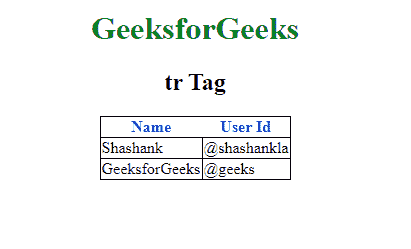

# HTML tr 标签

> 哎哎哎:# t0]https://www . geeksforgeeks . org/html-tr 标签/

**< tr >标签**用于定义 HTML 表格中的一行。 **< tr >** 元素包含多个< th >或< td >元素。

**语法:**

```html
<tr>.....</tr>
```

**属性:**

*   **对齐:**对齐内容。
*   **bgcolor:** 指定行背景
*   **字符:**将内容与字符对齐
*   **charoff:** 设置字符数
*   **标记:**垂直对齐内容

**示例:**

```html
<!DOCTYPE html>
<html>

<head>
    <title>tr tag</title>
    <style>
        body {
            text-align: center;
        }

        h1 {
            color: green;
        }

        th {
            color: blue;
        }

        table,
        tbody,
        td {
            border: 1px solid black;
            border-collapse: collapse;
        }
    </style>
</head>

<body>
    <center>
        <h1>GeeksforGeeks</h1>
        <h2>tr Tag</h2>
        <table>
            <thead>
                <!-- tr tag starts here -->
                <tr>
                    <th>Name</th>
                    <th>User Id</th>
                </tr>
                <!-- tr tag end here -->
            </thead>
            <tbody>
                <tr>
                    <td>Shashank</td>
                    <td>@shashankla</td>
                </tr>
                <tr>
                    <td>GeeksforGeeks</td>
                    <td>@geeks</td>
                </tr>
            </tbody>
        </table>
    </center>
</body>

</html>
```

**输出:**


**支持的浏览器:**以下列出了 **HTML < tr >标签**支持的浏览器:

*   谷歌 Chrome
*   微软公司出品的 web 浏览器
*   火狐浏览器
*   苹果 Safari
*   歌剧