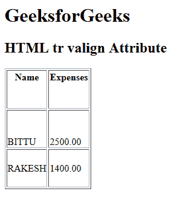

# HTML | tr valign Attribute

> 原文：[https://www.geeksforgeeks.org/html-tr-valign-attribute/](https://www.geeksforgeeks.org/html-tr-valign-attribute/)

The **HTML <tr> valign Attribute** is used to *specify the vertical alignment of text content in a table row*. It is not supported by HTML 5.

**Syntax:**

```html
<tr valign= "top | middle | bottom | baseline">
```

**Attribute Values:**

*   **top:** It sets the content to top-align.
*   **middle:** It sets the content to middle-align.
*   **bottom:** It sets the content to bottom-align.
*   **baseline:** It sets the content to baseline. The baseline is the line where most of the characters sit.

**Example:**

```html
<!DOCTYPE html>
<html>

<head>
    <title>
      HTML tr valign Attribute
  </title>
</head>

<body>
    <h1>GeeksforGeeks</h1>

    <h2>HTML tr valign Attribute</h2>

    <table style="height:200px" border="1">
        <tr valign="top">
            <th>Name</th>
            <th>Expenses</th>
        </tr>

        <tr valign="bottom">
            <td>BITTU</td>
            <td>2500.00</td>
        </tr>

        <tr valign="middle">
            <td>RAKESH</td>
            <td>1400.00</td>
        </tr>
    </table>
</body>

</html>
```

**Output:**


**Supported Browsers:** The browser supported by **HTML <tr> valign attribute** are listed below:

*   Google Chrome
*   Internet Explorer
*   Firefox
*   Safari
*   Opera