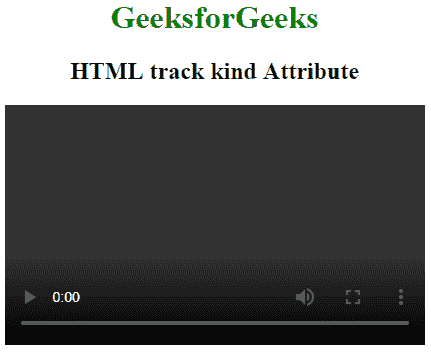
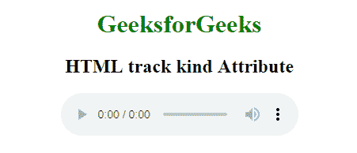

# HTML |种类属性

> 原文:[https://www.geeksforgeeks.org/html-track-kind-attribute/](https://www.geeksforgeeks.org/html-track-kind-attribute/)

**HTML <轨道>种类属性**用于指定视频和音频文件的轨道种类。如果听众或观众是聋子，这是非常有用的。

**语法:**

```html
<track src="subtitles_en.vtt" kind="subtitles" srclang="en">
```

**属性值:**要么是**真**要么是**假**显示轨迹默认状态。默认情况下，它是假的。

*   **字幕:**定义对话和音效的翻译，也适合聋人用户。
*   **元数据:**表示脚本使用但不向用户显示的内容。
*   **章节:**定义适合导航媒体资源的章节标题。
*   **字幕:**在视频和音频中显示字幕。
*   **描述:**描述视频或音频内容的文本描述。

**例 1:** 本例用视频元素说明了<轨迹>的种类属性。

## 超文本标记语言

```html
<!DOCTYPE html>
<html>

<head>
    <title>
        HTML track kind Attribute
    </title>

    <style>
        body {
            text-align: center;
        }
        h1 {
            color: green;
        }
    </style>
</head>

<body>
    <h1>GeeksforGeeks</h1>

    <h2>HTML track kind Attribute</h2>

    <video width="420" height="240" controls>
        <source src="video1" type="video/mp4">
        <track src="subtitles_en.vtt" kind="subtitles"
                      srclang="en" label="English">
    </video>
</body>

</html>          
```

**输出:**



**例 2:** 本例用音频元素说明了<轨道>类属性的使用。

## 超文本标记语言

```html
<!DOCTYPE html>
<html>

<head>
    <title>
        HTML track kind Attribute
    </title>

    <style>
        body {
            text-align: center;
        }
        h1 {
            color: green;
        }
    </style>
</head>

<body>
    <h1>GeeksforGeeks</h1>

    <h2>HTML track kind Attribute</h2>

    <audio  controls>
        <source src="audiofile_name" type="audio/mp3">

        <track src="subtitles_en.vtt" kind="subtitles"
                      srclang="en" label="English">
    </audio>
</body>

</html>          
```

**输出:**



**支持的浏览器:**HTML<轨迹>种类属性支持的浏览器如下:

*   谷歌 Chrome 18.0
*   Internet Explorer 10.0
*   Mozilla Firefox 31.0
*   Safari 6.0
*   Opera 15.0