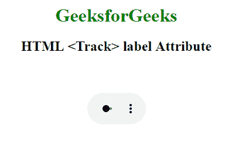

# HTML | track label Attribute

> 原文：[https://www.geeksforgeeks.org/html-track-label-attribute/](https://www.geeksforgeeks.org/html-track-label-attribute/)

The **HTML <track> label Attribute** is used to specify the label of the text track.

**Syntax:**

```html
<track src="subtitles_en.vtt" kind="subtitles" srclang="en" label="English"> 
```

**Attribute Values:**

*   **label:** It specify the label of the text track.

**Example:**

```html
<!DOCTYPE html>
<html>

<head>
    <style>
        body {
            text-align: center;
        }

        h1 {
            color: green;
        }
    </style>
</head>

<body>
    <h1>GeeksforGeeks</h1>
    <h2>
      HTML <Track> label Attribute
  </h2>

    <video width="100" 
           height="100" 
           controls>

        <track src=
"https://contribute.geeksforgeeks.org/wp-content/uploads/11.mp4" 
               id="myTrack1" 
               kind="subtitles" 
               srclang="en" 
               label="English"
               default>

            <source id="myTrack" 
                    src=
"https://contribute.geeksforgeeks.org/wp-content/uploads/11.mp4" 
                    type="video/mp4">

    </video>
</body>

</html>
```

**Output:**


**Supported Browsers:** The browsers supported by **<track> label Attribute** are listed below:

*   Google Chrome
*   Internet Explorer
*   Firefox
*   Apple Safari
*   Opera