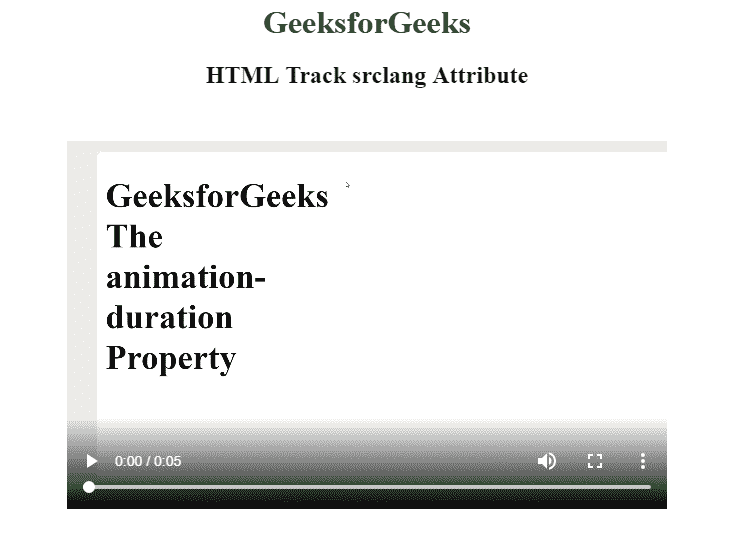

# HTML | track tag

> 原文：[https://www.geeksforgeeks.org/html-track-tag/](https://www.geeksforgeeks.org/html-track-tag/)

The **<track> tag** specifies text tracks for media components audio and video
This part is employed to specify subtitles, caption files or different files containing text, that ought to be visible once the media is taking part in.

**Syntax:**

```html
<track Attribute>
```

**Attribute:**

*   **default:** Specifies to that track to enabled if the user want to change the track
*   **kind:** Specifies the kind of text track
*   **label:** the title of the text track
*   **src:** It is for URL of the track file
*   **srclang:** It tell the language of the track text data (required if kind=”subtitles”)

**Example:**

```html
<html>

<head>
</head>

<body style="text-align: center">
    <h1 style="color: green"> 
    GeeksforGeeks 
</h1>
    <h2>HTML Track srclang Attribute</h2>

    <video width="600" height="400" controls>

        <track src="CSS-animation-duration02.mp4" 
               id="myTrack1"
               kind="subtitles"
               srclang="en"
               label="English">

            <source id="myTrack" 
                    src="CSS-animation-duration02.mp4" 
                    type="video/mp4">
    </video>
</body>

</html>
```

**Output:**


**Supported Browsers:** The browsers supported by **HTML <track> tag** are listed below:

*   Google Chrome
*   Internet Explorer
*   Firefox
*   Apple Safari
*   Opera