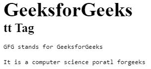

# HTML tt Tag

> 原文：[https://www.geeksforgeeks.org/html-tt-tag/](https://www.geeksforgeeks.org/html-tt-tag/)

The <tt> tag is the abbreviation of teletype text. This tag is depreciated from HTML 5\. It was used for marking Keyboard input. It was mainly used for formatting purposes. This tag was used in HTML 4 (Not Supported in HTML5).
**Syntax:** 

```html
<tt> Contents... </tt>
```

Below example illustrates the <tt> tag in HTML:

**Example:** 

## HTML

```html
<html>

    <body>
        <h1>GeeksforGeeks</h1>
        <h2>tt Tag</h2>

       <!-- HTML tt Tag is used here-->
       <tt>GfG stands for GeeksforGeeks</tt>

<p><tt>It is a computer science portal for geeks</tt></p>

    </body>

</html>                                       
```

**Output:** 



**Supported Browsers:** 

*   Google Chrome
*   Internet Explorer
*   Firefox
*   Opera
*   Safari