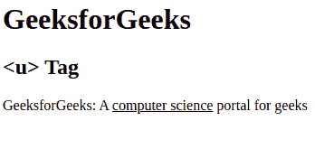
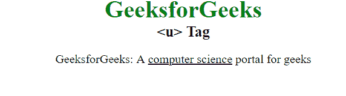

# HTML u Tag

> 原文：[https://www.geeksforgeeks.org/html-u-tag/](https://www.geeksforgeeks.org/html-u-tag/)

The <u> tag in HTML stands for underline, and it’s used to underline the text enclosed within the <u> tag. This tag is generally used to underline misspelled words. This tag requires a starting as well as ending tag.

**Syntax:**  

```html
<u> Contents... </u>
```

**Note:** This tag is depreciated from HTML 4.1 and redefined in HTML 5.
Below examples illustrates the <u> tag in HTML:
**Example 1:** 

## HTML

```html
<html>

    <body>
        <h1>GeeksforGeeks</h1>
        <h2><u> Tag</h2>

<p>GeeksforGeeks: A <u>computer science</u>
                                portal for geeks</p>

    </body>

</html>                   
```

**Output:** 



**Example 2:** Alternate way of <u> tag to underline the text. 

## HTML

```html
<html>
    <head>
        <title>u Tag</title>
        <style>
            body {
                text-align:center;
            }
            .gfg {
                font-size:40px;
                font-weight:bold;
                color:green;
            }
            .geeks {
                font-size:25px;
                font-weight:bold;
            }
            p {
                font-size:20px;
            }
            span {
                text-decoration:underline;
            }
        </style>
    </head>
    <body>
        <div class = "gfg">GeeksforGeeks</div>
        <div class = "geeks"><u> Tag</div>

<p>GeeksforGeeks: A <span>computer science</span>
                                       portal for geeks</p>

    </body>
</html>                   
```

**Output:** 



**Supported Browsers:** 

*   Google Chrome
*   Internet Explorer
*   Firefox
*   Opera
*   Safari