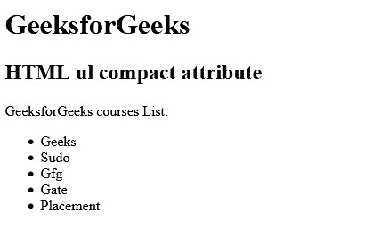

# HTML | ul compact Attribute

> 原文：[https://www.geeksforgeeks.org/html-ul-compact-attribute/](https://www.geeksforgeeks.org/html-ul-compact-attribute/)

The **HTML | <ul> compact Attribute** is used to define the list should be smaller than the normal by reducing the space between the list items and the indentation of the list. It is a Boolean attribute.

**Syntax: **

```html
<ul compact> 
```

**Note:** The HTML ul compact attribute is not supported by HTML 5.
**Examples:** 

## html

```html
<!DOCTYPE html> 
<html> 

<head> 
    <title>HTML ul compact attribute</title> 
</head> 

<body> 
    <h1>GeeksforGeeks</h1> 

    <h2>HTML ul compact attributeg</h2> 

<p>GeeksforGeeks courses List:</p>

    <ul compact> 
        <li>Geeks</li> 
        <li>Sudo</li> 
        <li>Gfg</li> 
        <li>Gate</li> 
        <li>Placement</li> 
    </ul> 
</body> 

</html>                     
```

**Output:** 



**Supported Browsers:** This attribute is not supported by any browsers this days.