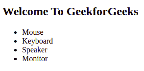
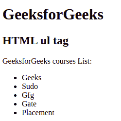
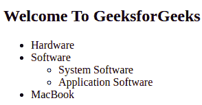
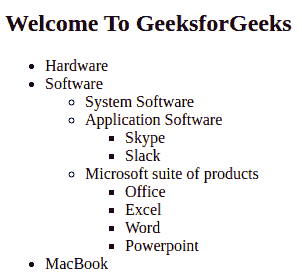

# HTML ul Tag

> 原文：[https://www.geeksforgeeks.org/html-ul-tag/](https://www.geeksforgeeks.org/html-ul-tag/)

In this article, we will know the HTML <ul> Tag & its implementation. The **<ul> tag** in HTML is used to define the unordered list item in an HTML document. It contains the list items <li> element. The <ul> tag requires an opening and closing tag. By using CSS style you can easily design an unordered list.

**Syntax:** 

```html
<ul> list of items </ul>
```

**Accepted attribute:** This tag contains two attributes which are listed below: 

*   [**HTML <ul> compact Attribute**](https://www.geeksforgeeks.org/html-ul-compact-attribute/)**:** It will render the list smaller.
*   [**HTML <ul> type Attribute**](https://www.geeksforgeeks.org/html-ul-type-attribute/)**:** It specifies which kind of marker is used in the list.

**Note:** The <ul> attributes are not supported by HTML 5.

**Example:** In this example, we have created an unordered list of computer parts using the <ul> tag.

## HTML

```html
<!DOCTYPE html>
<html>

<body>
  <h2>Welcome To GeekforGeeks</h2>
  <ul>
    <li>Mouse</li>
    <li>Keyboard</li>
    <li>Speaker</li>
    <li>Monitor</li>
  </ul>
</body>

</html>
```

**Output:**



HTML Unordered List

**Example 1:** This example describes the Unordered List in HTML.

## HTML

```html
<!DOCTYPE html>
<html>

<head>
  <title>HTML ul tag</title>
</head>

<body>
  <h1>GeeksforGeeks</h1>
  <h2>HTML ul tag</h2>
  <p>GeeksforGeeks courses List:</p>
  <ul>
    <li>Geeks</li>
    <li>Sudo</li>
    <li>Gfg</li>
    <li>Gate</li>
    <li>Placement</li>
  </ul>
</body>

</html>
```

**Output:**



HTML Unordered List

**Example 2:** Nested unordered list, a list inside other lists is known as a nested list.

## HTML

```html
<!DOCTYPE html>
<html>

<head>
  <title>Nested unordered list</title>
</head>

<body>
  <h2>Welcome To GeeksforGeeks</h2>
  <ul>
    <li>Hardware</li>
    <li>
      Software
      <ul>
        <li>System Software</li>
        <li>Application Software</li>
      </ul>
    </li>
    <li>MacBook</li>
  </ul>
</body>

</html>
```

**Output:**



Nested Unordered List

**Example 3:** Complex nested unordered list.

## HTML

```html
<!DOCTYPE html>
<html>

<head>
  <title>Nested unordered list</title>
</head>

<body>
  <h2>Welcome To GeeksforGeeks</h2>
  <ul>
    <li>Hardware</li>
    <li>
      Software
      <ul>
        <li>System Software</li>
        <li>Application Software</li>
        <ul>
          <li>Skype</li>
          <li>Slack</li>
        </ul>
        <li>Microsoft suite of products</li>
        <ul>
          <li>Office</li>
          <li>Excel</li>
          <li>Word</li>
          <li>Powerpoint</li>
        </ul>
      </ul>
    </li>
    <li>MacBook</li>
  </ul>
</body>

</html>
```

**Output:**



Complex Nested Unordered List

**Supported Browsers:** 

*   Google Chrome
*   Internet Explorer
*   Microsoft Edge
*   Firefox
*   Safari
*   Opera