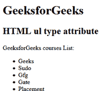

# HTML | ul type Attribute

> 原文：[https://www.geeksforgeeks.org/html-ul-type-attribute/](https://www.geeksforgeeks.org/html-ul-type-attribute/)

The **HTML <ul> type Attribute** is used to specifies that which kind of marker used in the list.
**Note:** The ul type attributes are not supported by HTML 5.
**Syntax:**

```html
<ul type="disc | circle | square">
```

**Attribute Values:**

*   **disc:** Default. A filled circle.
*   **circle:** An unfilled circle
*   **square** A filled square.

**Example 1: **

## html

```html
<!DOCTYPE html>
<html>

<head>
    <title>HTML ul type attribute</title>
</head>

<body>
    <h1>GeeksforGeeks</h1>

    <h2>HTML ul type attribute</h2>

<p>GeeksforGeeks courses List:</p>

    <ul>
        <li>Geeks</li>
        <li>Sudo</li>
        <li>Gfg</li>
        <li>Gate</li>
        <li>Placement</li>
    </ul>
</body>

</html>                    
```

**Output:**



**Example 2: **

## html

```html
<!DOCTYPE html>
<html>

<head>
    <title>HTML ul type attribute</title>
</head>

<body>
    <h1>GeeksforGeeks</h1>

    <h2>HTML ul type attribute</h2>

<p>GeeksforGeeks courses List:</p>

    <ul type="square">
        <li>Geeks</li>
        <li>Sudo</li>
        <li>Gfg</li>
        <li>Gate</li>
        <li>Placement</li>
    </ul>
</body>

</html>                    
```

**Output:**


**Supported Browsers:** The browser supported by HTML <ul> Type attribute are listed below:

*   Google Chrome
*   Internet Explorer
*   Firefox
*   Safari
*   Opera