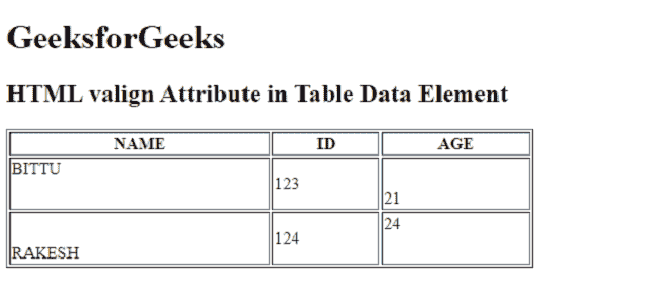

# HTML 标签属性

> 原文:[https://www.geeksforgeeks.org/html-valign-attribute/](https://www.geeksforgeeks.org/html-valign-attribute/)

**HTML*****valign*****属性用于指定元素中文本的垂直对齐方式。该属性支持许多[表](https://www.geeksforgeeks.org/html-tables/)相关元素，如< tr >、< td >、< tbody >、< col >、< tfoot >。**

****语法:****

```html
<element valign="top | middle | bottom | baseline">
```

****属性值:****

*   ****顶部:**它将内容设置为顶部对齐。**
*   ****中间:**将内容设置为中间对齐。**
*   ****底部:**它将内容设置为底部对齐。**
*   ****基线:**设置内容为基线。基线是表格数据元素中大多数字符所在的行。**

****示例:**下面的代码说明了 *valign* 属性在 HTML 文档中的使用。**

## **超文本标记语言**

```html
<!DOCTYPE html>
<html>

<head>
    <title>
        HTML valign Attribute in <td> element
    </title>
</head>

<body>
    <h1>GeeksforGeeks</h1>

    <h2>HTML valign Attribute in Table Data Element</h2>

    <table border="1" width="500">
        <tr>
            <th>NAME</th>
            <th>ID</th>
            <th>AGE</th>
        </tr>

        <tr style="height:50px;">
            <td valign="top">BITTU</td>
            <td valign="center">123</td>
            <td valign="bottom">21</td>
        </tr>

        <tr style="height:50px;">
            <td valign="bottom">RAKESH</td>
            <td valign="center">124</td>
            <td valign="top">24</td>
        </tr>
    </table>
</body>
</html>
```

****输出:****

****

****支持的浏览器**:**

*   **谷歌 Chrome**
*   **微软公司出品的 web 浏览器**
*   **火狐浏览器**
*   **旅行队**
*   **歌剧**