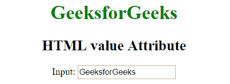
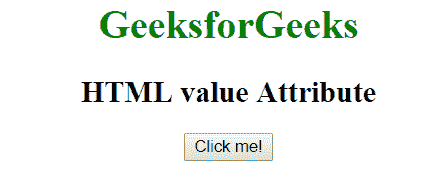
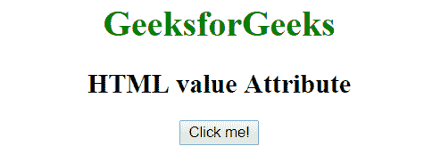
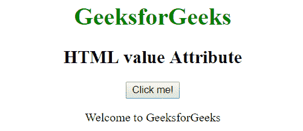
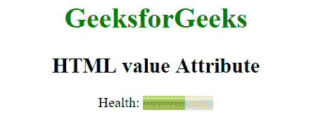
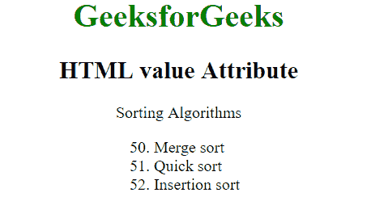
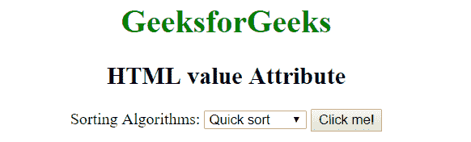
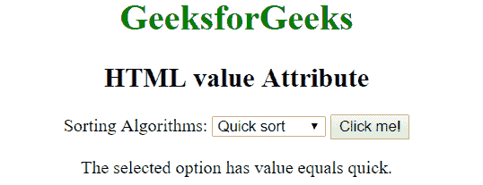
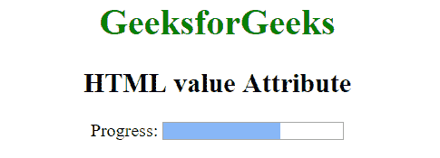

# HTML |值属性

> 原文:[https://www.geeksforgeeks.org/html-value-attribute/](https://www.geeksforgeeks.org/html-value-attribute/)

HTML 中的**值**属性用于指定与其一起使用的元素的值。对于不同的 HTML 元素有不同的含义。
**用法:**可搭配以下元素使用:<输入>、<按钮>、<仪表>、< li >、<选项>、<进度>、<参数>、<输出>。

**<输入> :** 当值属性存在时，指定输入元素的初始值。
对于不同的输入类型有不同的含义:

*   当出现在“按钮”、“重置”和“提交”中时，它指定按钮上的文本。
*   当出现在“文本”、“密码”和“隐藏”中时，它指定输入字段的初始值。
*   当出现在“复选框”、“单选”和“图像”中时，它指定与输入相关联的值。

*   **语法:**

    ```html
    <input value = "value">
    ```

*   **示例-1:**

    ```html
    <!DOCTYPE html>
    <html>
        <head>
            <title>HTML value Attribute</title>
        </head>
        <body style = "text-align:center">
            <h1 style = "color:green;">
                GeeksforGeeks
            </h1>

            <h2>
                HTML value Attribute
            </h2>

            Input: <input type = "text" value = "GeeksforGeeks">

        </body>
    </html>
    ```

*   **输出:**
    
*   **示例-2:**

    ```html
    <!DOCTYPE html>
    <html>
        <head>
            <title>HTML value Attribute</title>
        </head>
        <body style = "text-align:center">
            <h1 style = "color:green;">
                GeeksforGeeks
            </h1>

            <h2>
                HTML value Attribute
            </h2>

            <input type = "button" value = "Click me!">

        </body>
    </html>
    ```

*   **Output:**
    

    **<按钮> :** 当值属性存在时，指定按钮元素的初始值。

*   **语法:**

    ```html
    <button value = "value">
    ```

*   **例:**

    ```html
    <!DOCTYPE html>
    <html>
        <head>
            <title>HTML value Attribute</title>
        </head>
        <body style = "text-align:center">
            <h1 style = "color:green;">
                GeeksforGeeks
            </h1>

            <h2>
                HTML value Attribute
            </h2>

            <button id="btn" value="GeeksforGeeks" onclick="geek()">
             Click me!</button>

            <p id="g"></p>

            <script>
                function geek() {
                  var x = document.getElementById("btn").value;
                  document.getElementById("g").innerHTML = "Welcome to " + x;
                }
            </script>
        </body>
    </html>
    ```

*   **Output:**
    **Before clicking the button:**
    
    **After clicking the button:**
    

    **<仪表> :** 指定仪表的当前值。该值必须介于最小值和最大值属性之间。

*   **语法:**

    ```html
    <meter value = "value">
    ```

*   **例:**

    ```html
    <!DOCTYPE html>
    <html>
        <head>
            <title>HTML value Attribute</title>
        </head>
        <body style = "text-align:center">
            <h1 style = "color:green;">
                GeeksforGeeks
            </h1>

            <h2>
                HTML value Attribute
            </h2>

            <p>Health: <meter min="0" low="40" high="90"
                              max="100" value="60"></meter></p>
        </body>
    </html>
    ```

*   **Output:**
    

    **< li > :** 当值属性存在时，指定列表项的初始值。它仅适用于有序列表。

*   **语法:**

    ```html
    <li value = "number">list item </li>
    ```

    *   **编号:**指定列表项的值。
*   **例:**

    ```html
    <!DOCTYPE html>
    <html>
        <head>
            <title>HTML value Attribute</title>
        </head>
        <body >
            <h1 style = "color: green;">
                GeeksforGeeks
            </h1>

            <h2>
                HTML value Attribute
            </h2>

            <p>Sorting Algorithms</p>

            <ol>
              <li value="50">Merge sort</li>
              <li>Quick sort</li>
              <li>Insertion sort</li>
            </ol>
        </body>
    </html>
    ```

*   **Output:**
    

    **<选项> :** 当值属性存在时，指定选项元素的值。

*   **语法:**

    ```html
    <option value = "value"></option>
    ```

*   **例:**

    ```html
    <!DOCTYPE html>
    <html>
        <head>
            <title>HTML value Attribute</title>
        </head>
        <body style = "text-align:center">
            <h1 style = "color: green;">
                GeeksforGeeks
            </h1>

            <h2>
                HTML value Attribute
            </h2>

            Sorting Algorithms:
            <select id="opt">
              <option value="quick">Quick sort</option>
              <option value="merge">Merge sort</option>
              <option value="insertion">Insertion sort</option>
            </select>

            <button type="button" onclick="geek()">Click me!</button>
            <p id = "p"></p>
            <script>
                function geek() {
                  var x = document.getElementById("opt").selectedIndex;
                  var y = document.getElementsByTagName("option")[x].value;
                  document.getElementById("p").innerHTML = "The selected 
                  option has value equals " + y + ".";
                }
            </script>
        </body>
    </html>
    ```

*   **Output:**
    **Before clicking the button:**
    
    **After clicking the button:**
    

    **<进度> :** 当值属性存在时，它指定进度元素的值。

*   **语法:**

    ```html
    <progress value = "number"></progress>
    ```

    *   **编号**指定进度元素的初始值。
*   **例:**

    ```html
    <!DOCTYPE html>
    <html>
        <head>
            <title>HTML value Attribute</title>
        </head>
        <body style = "text-align:center">
            <h1 style = "color: green;">
                GeeksforGeeks
            </h1>

            <h2>
                HTML value Attribute
            </h2>

            Progress:
            <progress value="65" max="100">
            </progress>
        </body>
    </html>
    ```

*   **Output:**
    

    **支持的浏览器:**值属性进行中元素支持的浏览器如下:

    *   谷歌 Chrome
    *   微软公司出品的 web 浏览器
    *   火狐浏览器
    *   歌剧
    *   旅行队