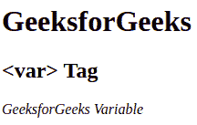

# HTML var Tag

> 原文：[https://www.geeksforgeeks.org/html-var-tag/](https://www.geeksforgeeks.org/html-var-tag/)

It is a phrase tag and used to specify the variable in a mathematical equation or in a computer program. The content of this tag is displayed in an italic format in most browsers.

**Syntax:** 

```html
<var> Contents... </var>
```

**Example:** 

## HTML

```html
<!DOCTYPE html>
<html>

    <body>
        <h1>GeeksForGeeks</h1>
        <h2><var> Tag</h2>

        <!-- HTML var Tag is used here-->
        <var>GeeksforGeeks Variable</var>

    </body>

</html>
```

**Output:** 



**Supported Browsers:** 

*   Google Chrome
*   Internet Explorer
*   Firefox
*   Opera
*   Safari