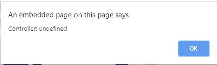

# HTML | DOM 视频控制器属性

> 原文:[https://www . geesforgeks . org/html-video-controller-property/](https://www.geeksforgeeks.org/html-video-controller-property/)

控制器属性返回视频的当前媒体控制器。默认情况下，视频元素没有媒体控制器。媒体控制器属性将返回一个媒体控制器对象。

**语法**

```html
videoObject.controller
```

**返回值**

*   **MediaController:** 表示视频的媒体控制器
    **对象:** MediaController 对象属性/方法:

*   缓冲–获取视频的缓冲范围
*   可搜索–获取视频的可搜索范围
*   持续时间–获取视频的持续时间
*   当前时间–获取或设置视频的播放位置
*   暂停–检查视频是否暂停
*   播放()–播放视频
*   暂停()–暂停视频
*   播放–检查视频是否已播放
*   默认回放速率–获取或设置视频的默认回放速率
*   回放速率–获取或设置视频的当前回放速率
*   音量–获取或设置视频的音量
*   静音–获取或设置视频是否静音

**示例:**

```html
<!DOCTYPE html>
<html>

<body>
    <video id="Test_Video" width="360" height="240" controls>

        <source id="mp4_source" src="sample2.mp4" type="video/mp4">

        <source id="ogg_source" src="sample2.ogg" type="video/ogg">
    </video>
    <br>
    <button onclick="myVideo()" type="button">Click It</button>
    <br>

    <script>
        var v = document.getElementById("Test_Video");

        function myVideo() {
            alert("Controller: " + v.controller);
        }
    </script>

</body>

</html>
```

**输出:**


**支持的浏览器:****HTML 视频控制器属性**支持的浏览器如下:

*   不支持谷歌浏览器
*   *不支持 internet Explorer*
*   **火狐*不支持***
*   **不支持 apple Safari**
*   ***不支持歌剧***