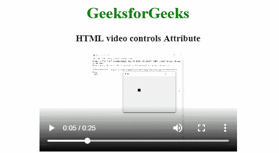

# HTML | video controls Attribute

> 原文：[https://www.geeksforgeeks.org/html-video-controls-attribute/](https://www.geeksforgeeks.org/html-video-controls-attribute/)

The **HTML <video> controls Attribute** is used to specify the control to play video. It is the Boolean value. This attribute is new in HTML5.

**The video control should include:**

*   Play
*   Pause
*   Volume
*   Full-screen Mode
*   Seeking
*   Captions/Subtitles(if available)
*   Track(if available)

**Syntax:**

```html
<video controls>
```

**Example:**

```html
<!DOCTYPE html>
<html>

<head>
    <title>HTML video controls Attribute</title>
</head>

<body>
    <center>
        <h1 style="color:green;">GeeksforGeeks</h1>

        <h3>HTML video controls Attribute</h3>

        <video width="400" height="200" controls>
            <source src=
"https://media.geeksforgeeks.org/wp-content/uploads/20190616234019/Canvas.move_.mp4" 
                                type="video/mp4">
            <source src=
"https://media.geeksforgeeks.org/wp-content/uploads/20190616234019/Canvas.move_.ogg" 
                                type="video/ogg">
        </video>
    </center>
</body>

</html>
```

**Output:**


**Note:** Always specify the width and the height of the video else web page will be confused that how much space that video will be required due to that reason web page become slow down.

**Supported Browsers:** The browser supported by HTML <video> controls Attribute are listed below:

*   Google Chrome 4.0
*   Internet Explorer 9.0
*   Firefox 3.5
*   Safari 4.0
*   Opera 10.5