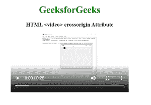

# HTML video crossorigin Attribute

> 原文：[https://www.geeksforgeeks.org/html-video-crossorigin-attribute/](https://www.geeksforgeeks.org/html-video-crossorigin-attribute/)

The **HTML crossorigin attribute** is used in the <video> element that supports a CORS request when we tried to fetch out the video files from the third-party servers or from another domain.

**Syntax:**

```html
<video crossorigin="anonymous | use-credentials">
```

**Attribute Values:**

*   **anonymous:** It has a default value. It defines a CORS request that will be sent without passing the credentials information.
*   **use-credentials:** A cross-origin request will be sent with credentials, cookies, and certificate.

**Example:** Below code illustrates the use of **crossorigin** attribute in the <video> element. It is set to “anonymous” value which retrieved the audio files without passing credentials information.

## HTML

```html
<!DOCTYPE html>
<html>

<body>
    <center>
        <h1 style="color:green;">
            GeeksforGeeks
        </h1>

        <h3>HTML <video>
            crossorigin Attribute</h3>

        <video crossorigin="anonymous" 
            width="400" height="200" controls
            src=
"https://media.geeksforgeeks.org/wp-content/uploads/20190616234019/Canvas.move_.mp4">
            Browser not supported
        </video>
    </center>
</body>

</html>
```

**Output:**



**Supported Browsers:**

*   Google Chrome 30.0
*   Firefox 13.0
*   Internet Explorer 18.0
*   Opera 12.0
*   Safari 1.0