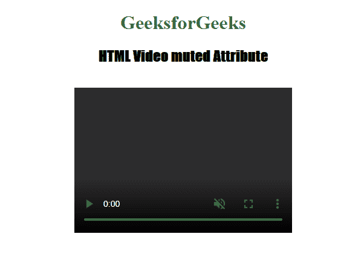

# HTML | video muted Attribute

> 原文：[https://www.geeksforgeeks.org/html-video-muted-attribute/](https://www.geeksforgeeks.org/html-video-muted-attribute/)

The **HTML <video> muted Attribute** is used to *specify the audio output of the video is muted*, it is a Boolean attribute.

**Syntax**

```html
<video muted>
```

**Example:**

```html
<!DOCTYPE html>
<html>

<head>
    <title>
        HTML Video muted Attribute
    </title>
</head>

<body style="text-align:center">
    <h1 style="color:green">
        GeeksforGeeks
        </h1>
    <h2 style="font-family: Impact">
      HTML Video muted Attribute
  </h2>
    <br>

    <video id="Test_Video"
           width="360" 
           height="240" 
           controls muted>

        <source src="samplevideo.mp4" 
                type="video/mp4">
    </video>
</body>

</html>
```

**Output:**


**Supported Browsers:** The browsers supported by **HTML <video> muted Attribute** are listed below:

*   Google Chrome 4.0
*   Internet Explorer 10.0
*   Firefox 11.0
*   Apple Safari 7.1
*   Opera 10.5