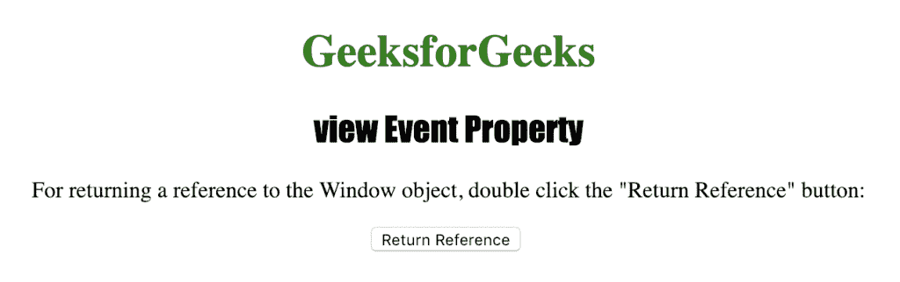
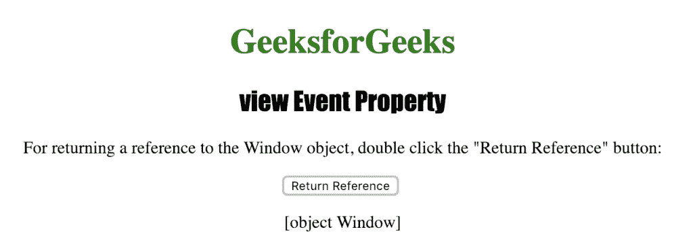

# HTML |查看事件属性

> 原文:[https://www.geeksforgeeks.org/html-view-event-property/](https://www.geeksforgeeks.org/html-view-event-property/)

**视图事件属性**用于返回对窗口对象的引用。当事件发生时，它返回窗口对象的引用。

**语法:**

```html
event.view
```

**返回值:**返回对窗口对象的引用。

下面的程序说明了视图事件属性:

```html
<!DOCTYPE html>
<html>

<head>
    <title>view Event Property in HTML</title>
    <style>
        h1 {
            color: green;
        }

        h2 {
            font-family: Impact;
        }

        body {
            text-align: center;
        }
    </style>
</head>

<body>

    <h1>GeeksforGeeks</h1>
    <h2>view Event Property</h2>

    <p>For returning a reference to the Window object,
      double click the "Return Reference" button: </p>

    <button ondblclick="myevent(event)">Return Reference</button>
    <br>

    <p id="test"></p>

    <script>
        function myevent() {
            var e = event.view;
            document.getElementById("test").innerHTML = e;
        }
    </script>

</body>

</html>

```

**输出:**


**点击**
按钮后

**支持的网络浏览器:**

*   歌剧
*   微软公司出品的 web 浏览器
*   谷歌 Chrome
*   火狐浏览器
*   苹果 Safari