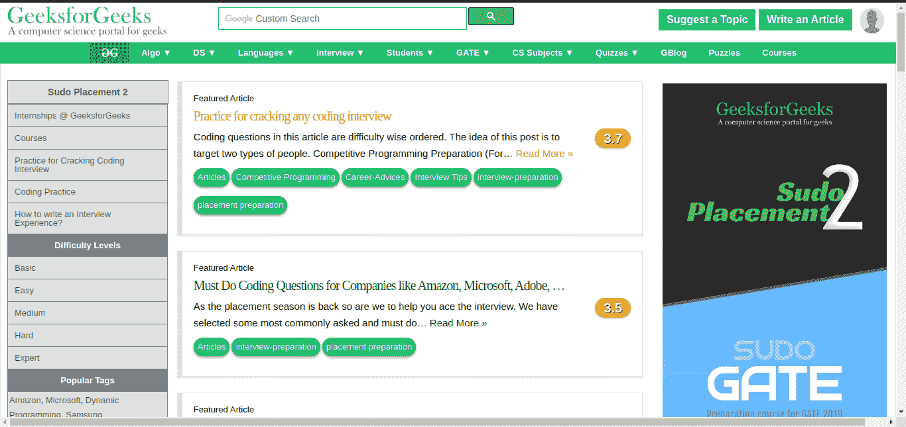
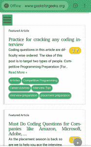
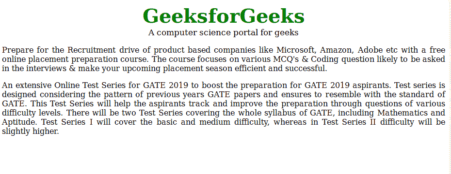
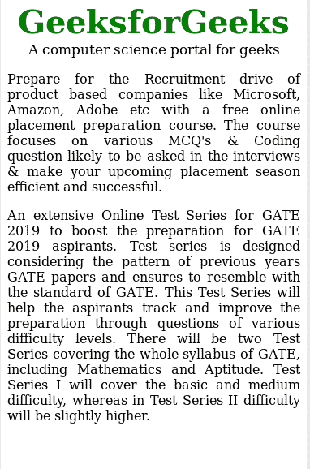

# 响应网页设计的 HTML |视口元标签

> 原文:[https://www . geesforgeks . org/html-viewport-meta-tag-for-responsive-web-design/](https://www.geeksforgeeks.org/html-viewport-meta-tag-for-responsive-web-design/)

**什么是视口？**
浏览器的视窗是用户可以看到内容的网页区域。视窗的大小不同，它会随着网站所在设备屏幕大小的变化而变化。对于笔记本电脑，与智能手机或平板电脑相比，视窗的尺寸更大。

**示例:**
笔记本电脑屏幕更宽


在智能手机上，由于屏幕变窄，页面会进行调整



**注意:**当页面对较小的视窗没有响应时，它在较小的屏幕上看起来很糟糕，甚至会破裂。为了解决这个问题，引入一个响应标签来控制视口。这个标签最早是苹果公司为 Safari iOS 推出的。

**语法:**

```html
<meta name="viewport" content= "width=device-width, initial-scale=1.0">
```

这是各种移动优化网站中常用的视口设置。width 属性控制视口的大小。可以根据 CSS 像素将其设置为特定值(“宽度=600”)。这里，它被设置为一个特殊的值(“宽度=设备宽度”)，即以 100%比例的 CSS 像素表示的设备宽度。首次加载页面时，初始比例属性控制缩放级别。

**注意:**元标签应该添加在 HTML 文档的头标中。

响应标签具有以下属性:

*   **宽度**:设备虚拟视口的宽度。
*   **高度**:设备虚拟视口的高度。
*   **初始缩放**:首次访问页面时的缩放级别。
*   **最小比例**:用户可以缩放页面的最小缩放级别。
*   **最大比例**:用户可以缩放页面的最大缩放级别。
*   **用户可缩放**:允许设备放大或缩小的标志。(值=是/否)。

**示例:**

```html
<!DOCTYPE html>
<html>
    <head>
        <title>GeeksforGeeks</title>
        <meta charset="utf-8" name="viewport" 
        content= "width=device-width, initial-scale=1.0">
        <style>
            .gfg {
                font-size:40px;
                font-weight:bold;
                color:green;
                text-align:center;
            }
            .geeks {
                font-size:17px;
                text-align:center;
            }
            p {
                text-align:justify;
            }
        </style>
    </head>
    <body>
        <div class = "gfg">GeeksforGeeks</div>
        <div class = "geeks">A computer science portal for geeks</div>

        <p>Prepare for the Recruitment drive of product based companies like
        Microsoft, Amazon, Adobe etc with a free online placement preparation
        course. The course focuses on various MCQ's & Coding question likely
        to be asked in the interviews & make your upcoming placement season 
        efficient and successful. </p>
        <p>An extensive Online Test Series for GATE 2019 to boost the 
        preparation for GATE 2019 aspirants. Test series is designed 
        considering the pattern of previous years GATE papers and ensures
        to resemble with the standard of GATE. This Test Series will help
        the aspirants track and improve the preparation through questions
        of various difficulty levels. There will be two Test Series 
        covering the whole syllabus of GATE, including Mathematics and
        Aptitude. Test Series I will cover the basic and medium difficulty, 
        whereas in Test Series II difficulty will be slightly higher. </p>
    </body>
</html>                    
```

**输出:**
宽显示输出:
T5】窄显示输出:
