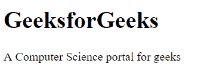

# HTML vs XML

> 原文:[https://www.geeksforgeeks.org/html-vs-xml/](https://www.geeksforgeeks.org/html-vs-xml/)

**HTML:** HTML ( **超文本标记语言**)用于创建网页和网络应用程序。它是一种标记语言。通过超文本标记语言，我们可以创建自己的静态页面。它用于显示数据而不是传输数据。HTML 是超文本和标记语言的结合。超文本定义了网页之间的链接。标记语言用于在定义网页结构的标签中定义文本文档。这种语言用于注释(为计算机做笔记)文本，以便机器能够理解它并相应地操作文本。

**示例:**

## 超文本标记语言

```html
<!DOCTYPE html>
<html> 
<head> 
    <title>GeeksforGeeks</title> 
</head> 
<body> 
    <h1>GeeksforGeeks</h1> 

<p>A Computer Science portal for geeks</p>

</body> 
</html> 
```

**输出:**



**XML:** XML ( **可扩展标记语言**)也用于创建网页和网络应用程序。它是动态的，因为它用于传输数据，而不是显示数据。XML 的设计目标集中在互联网上的简单性、通用性和可用性。这是一种文本数据格式，通过 Unicode 为不同的人类语言提供了强大的支持。虽然 XML 的设计侧重于文档，但是该语言被广泛用于表示任意数据结构，例如 web 服务中使用的数据结构。
**例:**

## 超文本标记语言

```html
<?xml version = "1.0"?> 
<contactinfo> 
    <address category = "college"> 
        <name>G4G</name> 
        <College>Geeksforgeeks</College> 
        <mobile>2345456767</mobile> 
    </address> 
</contactinfo> 
```

**输出:**

```html
G4G
Geeksforgeeks
2345456767
```

**HTML 和 XML 的区别:**HTML 和 XML 有很多区别。这些重要的区别如下:

<figure class="table">

| **HTML** | **XML** |
| HTML stands for hypertext markup language. | XML stands for extensible markup language. |
| HTML is static. | XML is dynamic. |
| HTML is a markup language. | XML provides a framework for defining markup languages. |
| HTML can ignore small errors. | XML does not allow errors. |
| HTML is case insensitive. | XML is case sensitive. |
| HTML tags are predefined tags. | XML tags are user-defined tags. |
| The number of tags in HTML is limited. | XML tags are extensible. |
| HTML does not retain spaces. | Spaces can be saved in XML. |
| HTML tags are used to display data. | XML tags are used to describe data that is not displayed. |
| In HTML, the closing tag is unnecessary. | In XML, the closing tag is required. |
| HTML is used to display data. | XML is used to store data. |
| HTML doesn't carry data, it just displays it. | XML carries the data of the database. |

</figure>