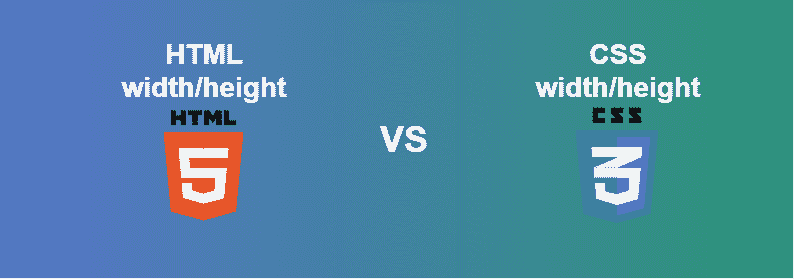
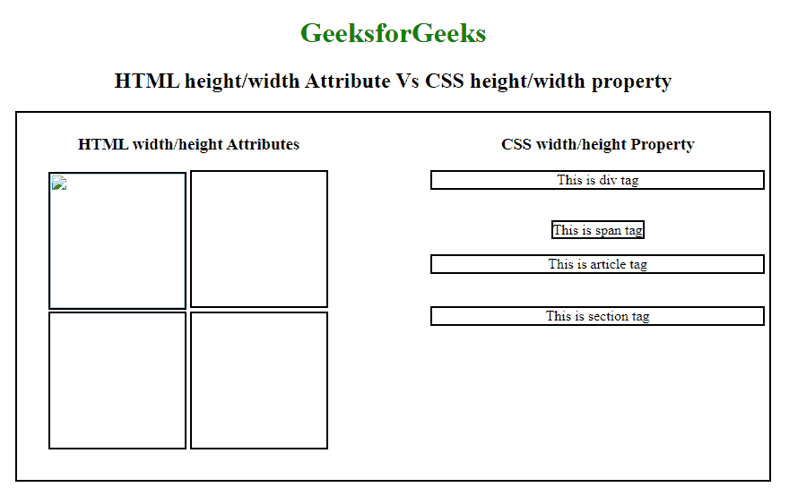

# HTML 宽度/高度属性对比 CSS 宽度/高度属性

> 原文:[https://www . geesforgeks . org/html-width-height-attribute-vs-CSS-width-height-property/](https://www.geeksforgeeks.org/html-width-height-attribute-vs-css-width-height-property/)



在 HTML 5 中，很少有元素遵循宽度和高度属性，最大元素不遵循该属性。像[**【img】**](https://www.geeksforgeeks.org/html-images/)、 [**iframe**](https://www.geeksforgeeks.org/html-iframes/) 、 [**canvas**](https://www.geeksforgeeks.org/html-canvas-basics/) ，以及 [**svg**](https://www.geeksforgeeks.org/html-svg-basics/) 一类的元素遵循宽度和高度属性但是 [**div**](https://www.geeksforgeeks.org/div-tag-html/) 、 [**span**](https://www.geeksforgeeks.org/span-tag-html/) 、 [**article**](https://www.geeksforgeeks.org/html5-article-tag/) 和 [**section【
宽度和高度属性在 **img** 、 **svg** 标签中受到影响，那些是弱类型的样式，可以被 CSS 覆盖。如果您分配了 **img** 标签，其**宽度=“500”**和**高度=“200”**，并为 **img** 标签加载 CSS 宽度和高度属性，如**宽度:400px**那么 500 会暗淡 400 会影响图像。**](https://www.geeksforgeeks.org/html-section-tag/) 

```html
<!-- Normally  in HTML -->


/* In CSS for override*/
img {
    width: 400px;
    height: 400px;
}
```

很少有更多的属性没有被选择用于对输出有很大影响的一些元素。要在这些元素上应用 CSS 属性，你必须知道 [**如何应用！在 CSS 中重要吗？**](https://www.geeksforgeeks.org/how-to-apply-important-in-css/) 。
**HTML 宽度/高度属性与 CSS 宽度/高度属性的区别:**

<figure class="table">

| HTML width/height attribute | CSS width/height attribute |
| Used to indicate. | Used for actual effects on web pages. |
| It has influence on a few HTML elements such as img, svg and canvas. | It affects all HTML elements (! Overlay inline styles may require important information). |
| It uses fluid images to reserve the required space for smooth loading. | It doesn't reserve the required space, so when elements appear, the page will vibrate several times. |

</figure>

以下示例使用高度/宽度属性和高度/宽度属性。
**例:**

## 超文本标记语言

```html
<!DOCTYPE html>
<html>

<head>
    <title>
        Comparison between height/width
        attributes and height/width
        property
    </title>

    <style>
        h1 {
            color: green;
        }
        .container {
            width: 95%;
            border: 2px solid black;
            padding: 5px;
            height: 400px;
        }

        .first {
            text-align: center;
            width: 45%;
            float: left;
        }

        .second {
            text-align: center;
            width: 45%;
            float: right;
        }
    </style>
</head>

<body>
    <center>
        <h1>GeeksforGeeks</h1>

        <h2>
            HTML height/width Attribute Vs
            CSS height/width property
        </h2>

        <div class="container">
            <div class="first">
                <h3>HTML width/height Attributes</h3>
                

                <iframe src="" width="150px" height="150px"
                        style="border:2px solid #000000;">
                </iframe>

                <canvas src="" width="150px" height="150px"
                        style="border:2px solid #000000;">
                </canvas>

                <svg src="" width="150px" height="150px"
                        style="border:2px solid #000000;">
                </svg>
            </div>

            <div class="second">
                <h3>CSS width/height Property</h3>
                <div width="150px" height="150px"
                        style="border:2px solid #000000;">
                    This is div tag
                </div>

                <br><br>

                <span width="150px" height="150px"
                        style="border:2px solid #000000;">
                    This is span tag
                </span>

                <br><br>

                <article width="150px" height="150px"
                        style="border:2px solid #000000;">
                    This is article tag
                </article>

                <br><br>

                <section width="150px" height="150px"
                        style="border:2px solid #000000;">
                    This is section tag
                </section>
            </div>
        </div>
    </center>
</body>

</html>
```

**输出:**

