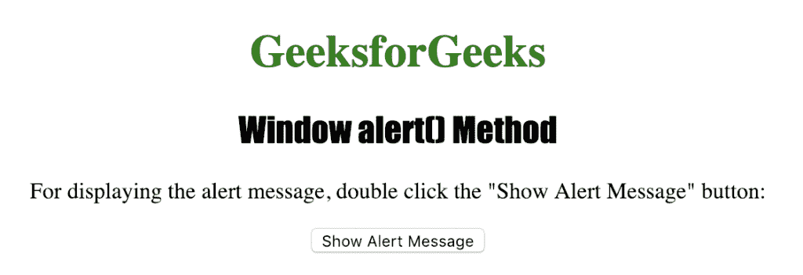
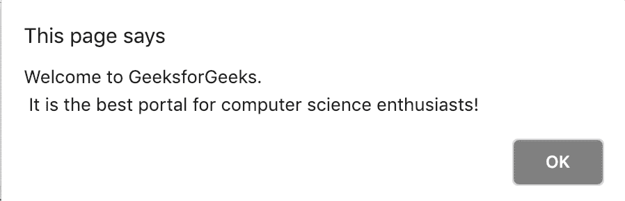

# HTML |窗口提醒( )方法

> 原文:[https://www.geeksforgeeks.org/html-window-alert-method/](https://www.geeksforgeeks.org/html-window-alert-method/)

**窗口提醒()方法**用于显示一个提醒框。它显示一条指定的消息和一个“确定”按钮，通常用于确保信息通过用户传递。
它返回一个字符串，代表要在警告框中显示的文本。

**语法:**

```html
alert(message)
```

下面的程序说明了窗口警报()方法:

**显示警告框。**

```html
<!DOCTYPE html>
<html>

<head>
    <title>
      Window alert() Method in HTML
    </title>
    <style>
        h1 {
            color: green;
        }

        h2 {
            font-family: Impact;
        }

        body {
            text-align: center;
        }
    </style>
</head>

<body>

    <h1>GeeksforGeeks</h1>
    <h2>Window alert() Method</h2>

    <p>
      For displaying the alert message, double
      click the "Show Alert Message" button: 
    </p>

    <button ondblclick="myalert()">
      Show Alert Message
    </button>

    <script>
        function myalert() {
            alert("Welcome to GeeksforGeeks.\n " +
                "It is the best portal for computer" + 
                         "science enthusiasts!");
        }
    </script>

</body>

</html>
```

**输出:**


**点击**
按钮后

**支持的浏览器:***窗口提醒( )方法*支持的浏览器如下:

*   谷歌 Chrome
*   微软公司出品的 web 浏览器
*   火狐浏览器
*   歌剧
*   旅行队