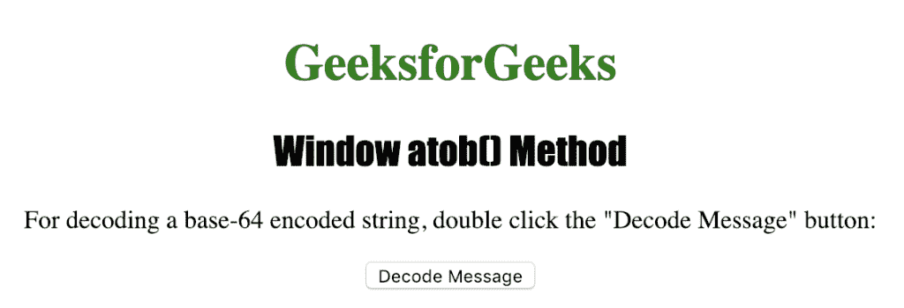
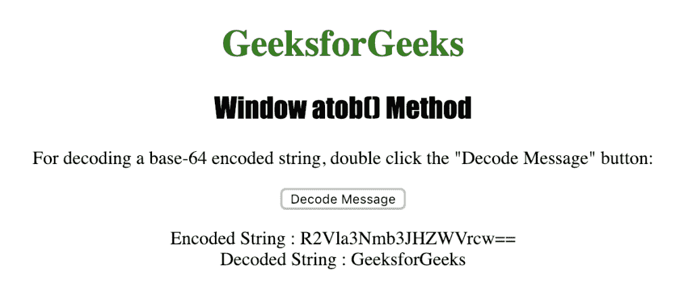

# HTML | Window atob()方法

> 原文:[https://www.geeksforgeeks.org/html-window-atob-method/](https://www.geeksforgeeks.org/html-window-atob-method/)

**窗口 atob()方法**用于解码以 64 为基数的编码字符串。它用于解码使用 btoa()方法编码的数据字符串。
返回一个代表解码字符串的字符串。

**语法:**

```html
window.atob(EncodedString)
```

**使用的参数:**

*   **编码字符串:**是指定编码字符串的强制参数。

下面的程序说明了窗口 atob()方法:

**解码使用 btoa()方法编码的字符串。**

```html
<!DOCTYPE html>
<html>

<head>
    <title>
      Window atob() Method in HTML
    </title>
    <style>
        h1 {
            color: green;
        }

        h2 {
            font-family: Impact;
        }

        body {
            text-align: center;
        }
    </style>
</head>

<body>

    <h1>GeeksforGeeks</h1>
    <h2>Window atob() Method</h2>

    <p>
      For decoding a base-64 encoded string,
      double click the "Decode Message" button:
    </p>

    <button ondblclick="decode()">
      Decode Message
    </button>

    <p id="myDecoding"></p>

    <script>
        function decode() {
            var original = "GeeksforGeeks";
            var encoded = window.btoa(original);
            var decoded = window.atob(encoded);

            var output = "Encoded String : " 
            + encoded + "<br>" + "Decoded String : "
            + decoded;
            document.getElementById("myDecoding").innerHTML =
              output;
        }
    </script>

</body>

</html>
```

**输出:**


**点击**
按钮后

**支持的浏览器:***Window atob()方法*支持的浏览器如下:

*   谷歌 Chrome
*   微软公司出品的 web 浏览器
*   火狐浏览器
*   歌剧
*   旅行队