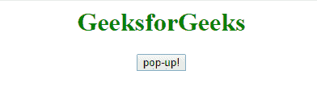

# HTML | Window createPopup()方法

> 原文:[https://www . geesforgeks . org/html-window-create popup-method/](https://www.geeksforgeeks.org/html-window-createpopup-method/)

html 窗口中的 **createPopup()方法**用于*创建一个弹出窗口*。

**语法:**

```html
window.createPopup()
```

**示例:**

```html
<html>

<head>
    <title>
      DOM createPopup() Method
  </title>
    <style>
        h1 {
            color: green;
        }
    </style>
</head>

<head>
    <script type="text/javascript">
        function show_popup() {
            var pop = window.createPopup()
            var popbody = pop.document.body
            popbody.style.backgroundColor = "lime"
            popbody.style.border = "solid black 1px"
            popbody.innerHTML = 
              "I am the pop-up, Click outside to close."
            pop.show(150, 150, 200, 50, document.body)
        }
    </script>
</head>

<body>
    <center>
        <h1>
          GeeksforGeeks
      </h1>
        <button onclick="show_popup()">
          pop-up!
      </button>
    </center>
</body>

</html>
```

**输出:**


**注意:**在 Internet Explorer 11 之前， **Window createPopup()方法**工作。

**支持的浏览器:**

*   **谷歌 Chrome:** 否
*   **Mozilla Firefox:** 否
*   **边缘:**否
*   **歌剧:**否
*   **狩猎:**否