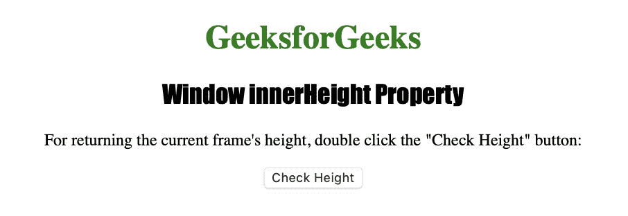
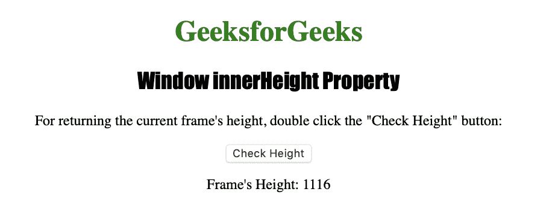

# HTML |窗口内部高度属性

> 原文:[https://www . geesforgeks . org/html-window-inner height-property/](https://www.geeksforgeeks.org/html-window-innerheight-property/)

**窗口内部高度属性**用于返回窗口内容区域的高度。它是一个只读属性，并返回一个数字，该数字以像素为单位表示浏览器窗口内容区域的高度。
**语法:**

```html
window.innerHeight
```

**返回值:**返回一个代表浏览器窗口内容区域高度的数字，以像素为单位。

下面的程序说明了窗口内部高度属性:
**返回当前帧的高度。**T3】

## 超文本标记语言

```html
<!DOCTYPE html>
<html>
<head>
    <title>
      Window innerHeight Property in HTML
    </title>
    <style>
        h1 {
            color: green;
        }

        h2 {
            font-family: Impact;
        }

        body {
            text-align: center;
        }
    </style>
</head>

<body>
    <h1>GeeksforGeeks</h1>
    <h2>Window innerHeight Property</h2>

<p>For returning the current frame's height,
      double click the "Check Height" button: </p>

    <button ondblclick="height()">Check Height</button>
    <p id="measure"></p>

    <script>
        function height() {

            var h = window.innerHeight;
            document.getElementById("measure").innerHTML
                               = "Frame's Height: " + h;
        }
    </script>

</body>

</html>  
```

**输出:**



**点击**按钮后



**支持的浏览器:***窗口内高属性*
支持的浏览器如下:

*   谷歌 Chrome
*   微软公司出品的 web 浏览器
*   火狐浏览器
*   歌剧
*   旅行队