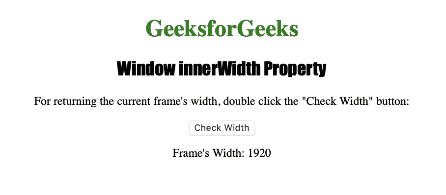

# HTML |窗口内宽属性

> 原文:[https://www . geesforgeks . org/html-window-inner width-property/](https://www.geeksforgeeks.org/html-window-innerwidth-property/)

**窗口内部宽度属性**用于返回窗口内容区域的宽度。它是一个只读属性，返回一个以像素为单位表示浏览器窗口内容区域宽度的数字。
**语法:**

```html
window.innerWidth
```

**返回值:返回一个**数字，以像素为单位表示浏览器窗口的内容区域宽度。

下面的程序说明了窗口内部宽度属性:
**返回当前帧的宽度。**T3】

## 超文本标记语言

```html
<!DOCTYPE html>
<html>

<head>
    <title>
      Window innerWidth Property in HTML
    </title>
    <style>
        h1 {
            color: green;
        }

        h2 {
            font-family: Impact;
        }

        body {
            text-align: center;
        }
    </style>
</head>

<body>

    <h1>GeeksforGeeks</h1>
    <h2>Window innerWidth Property</h2>

<p>
      For returning the current frame's width,
      double click the "Check Width" button:
    </p>

    <button ondblclick="width()">Check Width</button>

    <p id="measure"></p>

    <script>
        function width() {
            var w = window.innerWidth;
            document.getElementById("measure").innerHTML =
                                     "Frame's Width: " + w;
        }
    </script>

</body>

</html>  
```

**输出:**


**点击**按钮后



**支持的浏览器:***窗口内宽属性*支持的浏览器如下:

*   谷歌 Chrome
*   微软公司出品的 web 浏览器
*   火狐浏览器
*   歌剧
*   旅行队