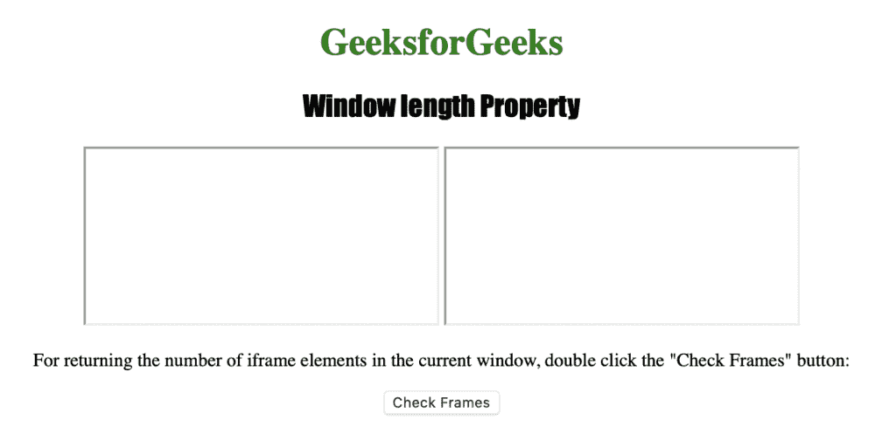
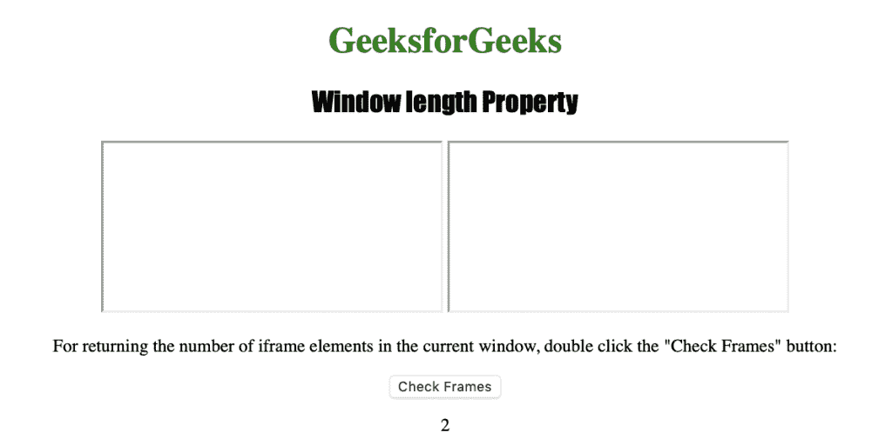

# HTML |窗口长度属性

> 原文:[https://www.geeksforgeeks.org/html-window-length-property/](https://www.geeksforgeeks.org/html-window-length-property/)

**窗口长度属性**用于返回当前窗口中< iframe >元素的个数。这是一个只读属性，它返回一个代表当前窗口中帧数的数字。
**语法:**

```html
window.length
```

**返回值:**返回一个代表当前窗口帧数的数值

下面的程序说明了窗口长度属性:
**返回当前窗口中< iframe >元素的数量。**T3】

## 超文本标记语言

```html
<!DOCTYPE html>
<html>

<head>
    <title>
      Window length Property in HTML
    </title>
    <style>
        h1 {
            color: green;
        }

        h2 {
            font-family: Impact;
        }

        body {
            text-align: center;
        }
    </style>
</head>

<body>

    <h1>GeeksforGeeks</h1>
    <h2>Window length Property</h2>

    <iframe src=
"https://www.geeksforgeeks.org">
    </iframe>
    <iframe src=
"https://practice.geeksforgeeks.org/courses/">
    </iframe>

<p>
      For returning the number of iframe elements
      in the current window, double click the
      "Check Frames" button:
    </p>

    <button ondblclick="frame()">
      Check Frames
    </button>

    <p id="count"></p>

    <script>
        function frame() {
            var c = window.length;
            document.getElementById("count").innerHTML = c;
        }
    </script>

</body>

</html>                                          
```

**输出:**



**点击**按钮后



**支持的浏览器:**窗口长度属性支持的浏览器如下:

*   谷歌 Chrome
*   微软公司出品的 web 浏览器
*   火狐浏览器
*   歌剧
*   旅行队