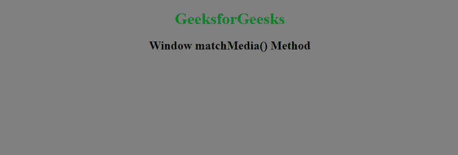
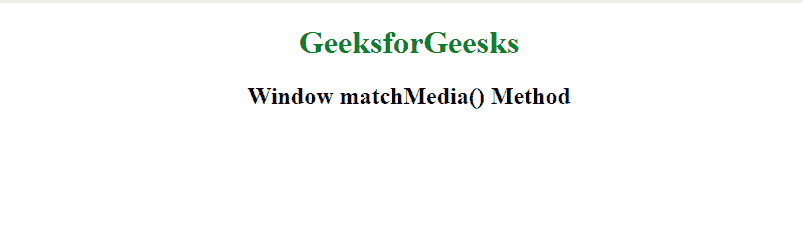

# HTML |窗口 matchMedia()方法

> 原文:[https://www . geesforgeks . org/html-window-match media-method/](https://www.geeksforgeeks.org/html-window-matchmedia-method/)

html 中的 **window.matchMedia()方法**用于返回一个 MediaQueryList 对象，该对象代表指定 CSS 媒体查询字符串的结果。matchMedia()方法的值可以是 CSS @media 规则的任何媒体选项，如最小高度、最小宽度、方向等。

MediaQueryList 对象有两个属性和两个方法:

1.  **属性:**
    *   **匹配:**用于检查查询结果，返回布尔值。
    *   **媒体:**表示序列化媒体查询列表的字符串。
2.  **方法:**
    *   **添加监听器(functionref):** 添加新的监听器函数，每当媒体查询的评估结果发生变化时，就会执行该函数。
    *   **移除监听器(功能参考):**从媒体查询列表中移除先前附加的监听器功能。如果指定的侦听器不在列表中，则不执行任何操作。

**语法:**

```html
window.matchMedia( mediaQueryString )
```

**参数值:**

*   **mediaQueryString:** 字符串，表示要为其返回新 MediaQueryList 对象的媒体查询。

**返回值:**此方法返回 CSS 媒体查询字符串。

**示例:**

```html
<!DOCTYPE html>
<html>

<head>
    <title>Window matchMedia() Method</title>
</head>

<body>
    <center>
        <h1 style="color:green">GeeksforGeesks</h1>
        <h2>Window matchMedia() Method</h2>

        <script>
            function GFGFun(ar) {
                if (ar.matches) {
                    document.body.style.backgroundColor = "white";
                } else {
                    document.body.style.backgroundColor = "gray";
                }
            }

            var ar = window.matchMedia("(max-width: 850px)")
            GFGFun(ar)
            ar.addListener(GFGFun)
        </script>
    </center>
</body>

</html>
```

**输出:**

*   **调整浏览器窗口大小前:**
    
*   **调整浏览器窗口大小后:**
    

**支持的浏览器:****HTML 窗口 matchMedia()方法**支持的浏览器如下:

*   谷歌 Chrome
*   微软公司出品的 web 浏览器
*   火狐浏览器
*   苹果 Safari
*   歌剧