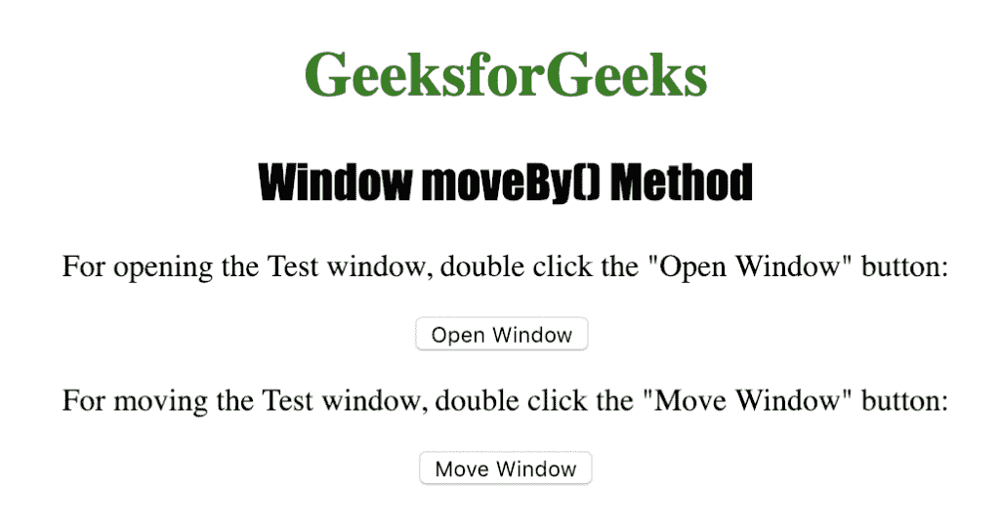
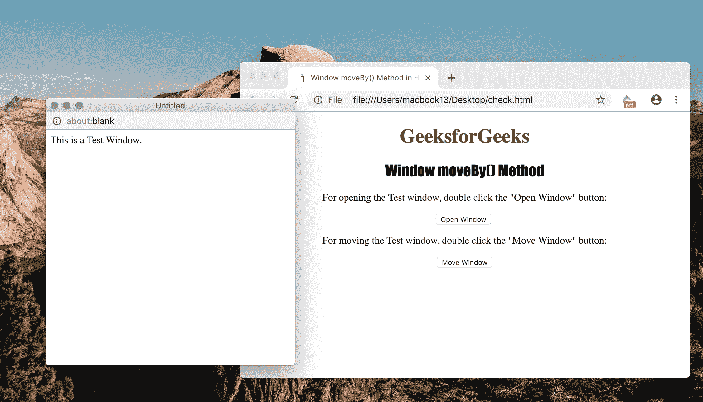

# HTML |窗口移动 By()方法

> 原文:[https://www.geeksforgeeks.org/html-window-moveby-method/](https://www.geeksforgeeks.org/html-window-moveby-method/)

**窗口移动 By()方法**用于相对于当前坐标移动具有指定像素数的窗口。
Window move by()方法接受两个参数 x 和 y，表示水平和垂直移动窗口的像素数。

**语法:**

```html
window.moveBy(x, y)
```

**使用的参数:**

*   **x :** 是指定水平移动窗口的像素数量的强制参数。
*   **y :** 是指定垂直移动窗口的像素数量的强制参数。

下面的程序说明了窗口移动方法:

**程序:。**相对于当前位置移动新窗口

```html
<!DOCTYPE html>
<html>

<head>
    <title>
      Window moveBy() Method in HTML
    </title>
    <style>
        h1 {
            color: green;
        }

        h2 {
            font-family: Impact;
        }

        body {
            text-align: center;
        }
    </style>
</head>

<body>

    <h1>GeeksforGeeks</h1>
    <h2>Window moveBy() Method</h2>

    <p>
      For opening the Test window, 
      double click the "Open Window" button:
    </p>

    <button ondblclick="Opwind()">
      Open Window
    </button>
    <br>

    <p>
      For moving the Test window,
      double click the "Move Window" button:
    </p>

    <button ondblclick="Movewind()">
      Move Window
    </button>

    <script>
        function Opwind() {
            TestWindow = window.open("", "TestWindow",
                "width=400, height=400");
            TestWindow.document.write("This is a Test Window.");
        }

        function Movewind() {
            TestWindow.moveBy(200, 200);
            TestWindow.focus();
        }
    </script>

</body>

</html>       
```

**输出:**


**点击**
按钮后

**支持的浏览器**:下面列出了 *Window moveBy()方法*支持的浏览器:

*   谷歌 Chrome
*   微软公司出品的 web 浏览器
*   火狐浏览器
*   歌剧
*   旅行队