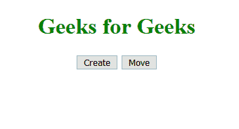
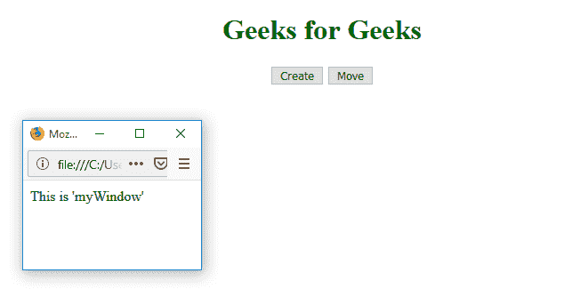
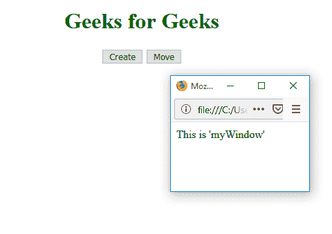

# HTML |窗口移动到()方法

> 原文:[https://www.geeksforgeeks.org/html-window-moveto-method/](https://www.geeksforgeeks.org/html-window-moveto-method/)

在窗口中使用**移动到()方法**从左上方坐标移动窗口到*。
**语法:*** 

```html
window.moveTo(x, y)
```

**参数:**

*   **x:** 一个正数或负数，指定要移动到的水平坐标
*   **y:** 正数或负数指定要移动到的垂直坐标

**示例:**移动窗口。

## 超文本标记语言

```html
<!DOCTYPE html>
<html>

<head>
    <title>
      Window moveTo() Method
    </title>
    <style>
        h1 {
            color: green;
        }
    </style>
</head>

<body>
    <center>
        <h1>Geeks for Geeks</h1>
        <button onclick="openWin()">
          Create
      </button>
        <button onclick="moveWin()">
          Move
      </button>

        <script>
            var myWindow;

            function openWin() {
                myWindow =
                  window.open("",
                              "myWindow",
                              "width=200",
                              "height=100");

                myWindow.document.write(
                  "
<p>This is 'myWindow'</p>
");
            }

            function moveWin() {
                myWindow.moveTo(500, 100);
                myWindow.focus();
            }
        </script>
    </center>
</body>

</html>
```

**输出:**
**初始:**



**新窗口:**



**移动窗口:**



**支持的浏览器:***Window moveTo()方法*支持的浏览器如下:

*   谷歌 Chrome
*   Mozilla Firefox
*   歌剧
*   旅行队
*   边缘