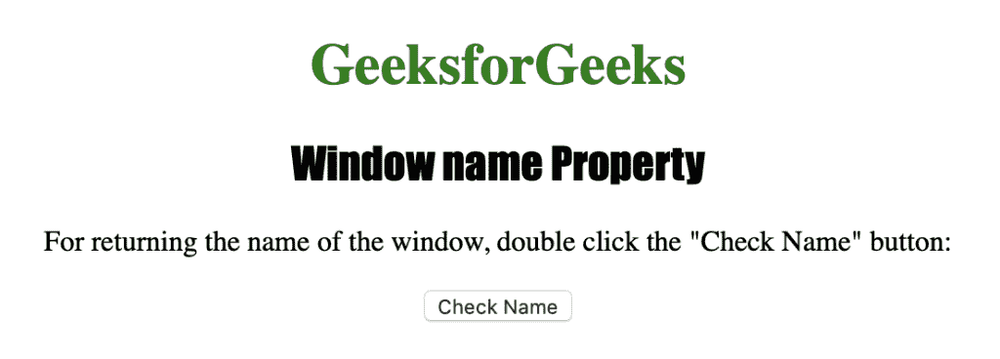
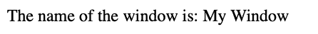

# HTML |窗口名称属性

> 原文:[https://www.geeksforgeeks.org/html-window-name-property/](https://www.geeksforgeeks.org/html-window-name-property/)

**窗口名称属性**用于设置或返回窗口名称。它通常用于修改过去创建的窗口的名称。它返回一个代表窗口名称的字符串。
**语法:**

```html
window.name
```

**返回值:**返回代表窗口名称的字符串值。

下面的程序说明了窗口名称属性:
**返回窗口的名称。**T3】

## 超文本标记语言

```html
<!DOCTYPE html>
<html>

<head>
    <title>
      Window name Property in HTML
    </title>
    <style>
        h1 {
            color: green;
        }

        h2 {
            font-family: Impact;
        }

        body {
            text-align: center;
        }
    </style>
</head>

<body>

    <h1>GeeksforGeeks</h1>
    <h2>Window name Property</h2>

<p>
      For returning the name of the window,
      double click the "Check Name" button:
    </p>

    <button ondblclick="fname()">Check Name</button>

    <!--window.open() defines the name of the window -->
    <!-- w.name property print the name of that window -->
    <script>
        function fname() {
            var w = window.open("","My Window",
                       "width=400, height=400");
            w.document.write("The name of the window is : "
                                      + w.name);
        }
    </script>

</body>

</html>
```

**输出:**



**点击**按钮后



**支持的浏览器:**以下是 *HTML |窗口名称属性*支持的浏览器:

*   谷歌 Chrome
*   微软公司出品的 web 浏览器
*   火狐浏览器
*   歌剧
*   旅行队