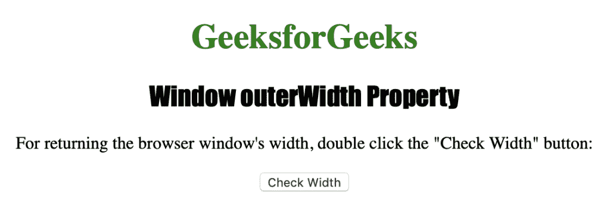
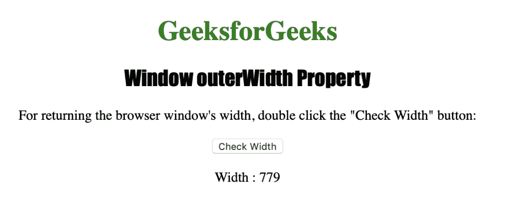

# HTML |窗口外宽属性

> 原文:[https://www . geesforgeks . org/html-window-outwidth-property/](https://www.geeksforgeeks.org/html-window-outerwidth-property/)

**窗口外部宽度属性**用于返回浏览器窗口的外部宽度。它包括所有的界面元素，如工具栏、滚动条等。它是一个只读属性，返回一个代表浏览器窗口宽度的数字(以像素为单位)。

**语法:**

```html
window.outerWidth
```

**返回值:**返回一个代表浏览器窗口宽度的数值，包括所有界面元素，单位为像素

下面的程序说明了窗口外部宽度属性:

**获取浏览器窗口的宽度。**

```html
<!DOCTYPE html>
<html>

<head>
    <title>
      Window outerWidth Property in HTML
    </title>
    <style>
        h1 {
            color: green;
        }

        h2 {
            font-family: Impact;
        }

        body {
            text-align: center;
        }
    </style>
</head>

<body>

    <h1>GeeksforGeeks</h1>
    <h2>Window outerWidth Property</h2>

    <p>
      For returning the browser window's width,
      double click the "Check Width" button:
    </p>

    <button ondblclick="pixel()">
      Check Width 
    </button>

    <p id="outerwidth"></p>

    <script>
        function pixel() {
            var width = window.outerWidth;
            document.getElementById("outerwidth").innerHTML = 
                               "Width : " + width;
        }
    </script>

</body>

</html>  
```

**输出:**


**点击**
按钮后

**支持的浏览器:***窗口外宽属性* 支持的浏览器如下:

*   谷歌 Chrome
*   微软公司出品的 web 浏览器
*   火狐浏览器
*   歌剧
*   旅行队