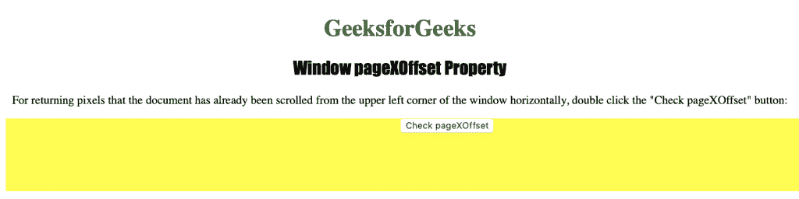

# HTML |窗口页面设置属性

> 原文:[https://www . geesforgeks . org/html-window-pagexoffset-property/](https://www.geeksforgeeks.org/html-window-pagexoffset-property/)

**Window pageXOffset 属性**用于返回当前文档中从窗口左上角水平滚动的像素。这是一个只读属性，它返回一个数字，该数字表示文档已经从窗口左上角水平滚动的像素数。
**语法:**

```html
window.pageXOffset
```

**返回值:**返回一个数字，代表文档已经从窗口左上角水平滚动的像素数。

下面的程序说明了 Window pageXOffset 属性:
**获取文档已经从窗口左上角水平滚动的像素。**T3】

## 超文本标记语言

```html
<!DOCTYPE html>
<html>

<head>
    <title>
      Window pageXOffset Property in HTML
    </title>
    <style>
        h1 {
            color: green;
        }

        h2 {
            font-family: Impact;
        }

        body {
            text-align: center;
        }

        div {
            border: 2px black;
            background-color: yellow;
            height: 100px;
            width: 2000px;
        }
    </style>
</head>

<body>

    <h1>GeeksforGeeks</h1>
    <h2>Window pageXOffset Property</h2>

<p>
      For returning pixels that the document has
      already been scrolled from the upper left
      corner of the window horizontally, double
      click the "Check pageXOffset" button:
    </p>

    <button ondblclick="offset()" style="position:fixed;">
        Check pageXOffset
    </button>

    <div>
    </div>

    <script>
        function offset() {
            window.scrollBy(100, 100);
            alert("pageXOffset : " + window.pageXOffset);
        }
    </script>

</body>

</html>
```

**输出:**



**点击**按钮后


**支持的浏览器:**窗口页面设置属性支持的浏览器如下:

*   谷歌 Chrome
*   微软公司出品的 web 浏览器
*   火狐浏览器
*   歌剧
*   旅行队