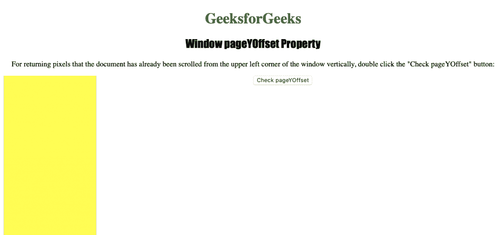

# HTML |窗口页面设置属性

> 原文:[https://www . geesforgeks . org/html-window-pageyoffset-property/](https://www.geeksforgeeks.org/html-window-pageyoffset-property/)

**窗口页面设置属性**用于返回当前文档中从窗口左上角垂直滚动的像素。这是一个只读属性，它返回一个数字，该数字表示文档已经从窗口左上角垂直滚动的像素数。

**语法:**

```html
window.pageYOffset
```

下面的程序说明了窗口页面设置属性:

**获取文档已经从窗口左上角垂直滚动的像素。**

```html
<!DOCTYPE html>
<html>

<head>
    <title>
      Window pageYOffset Property in HTML
    </title>
    <style>
        h1 {
            color: green;
        }

        h2 {
            font-family: Impact;
        }

        body {
            text-align: center;
        }

        div {
            border: 2px black;
            background-color: yellow;
            height: 2000px;
            width: 200px;
        }
    </style>
</head>

<body>

    <h1>GeeksforGeeks</h1>
    <h2>Window pageYOffset Property</h2>

    <p>
      For returning pixels that the document has already
      been scrolled from the upper left corner of the 
      window vertically, double click the "Check 
      pageYOffset" button: 
    </p>

    <button ondblclick="offset()" >
        Check pageYOffset
    </button>

    <div>
    </div>

    <script>
        function offset() {
            window.scrollBy(100, 100);
            alert("pageYOffset : " + window.pageYOffset);
        }
    </script>

</body>

</html>
```

**输出:**


**点击**
按钮后

**支持的浏览器:**窗口页面设置属性支持的浏览器如下:

*   谷歌 Chrome
*   微软公司出品的 web 浏览器
*   火狐浏览器
*   歌剧
*   旅行队