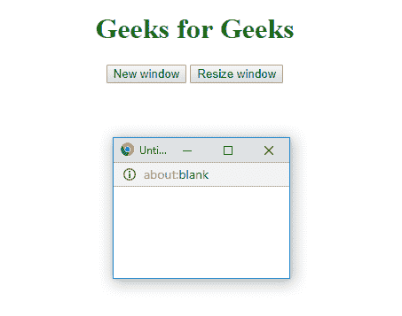
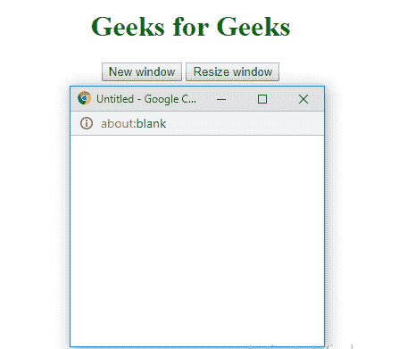

# HTML | Window resizeBy()方法

> 原文:[https://www.geeksforgeeks.org/html-window-resizeby-method/](https://www.geeksforgeeks.org/html-window-resizeby-method/)

HTML Window 中的 **resizeBy()方法**用于*相对于窗口的当前大小，按指定的量*调整窗口的大小。

**语法:**

```html
resizeBy(width, height)
```

**属性值:**

*   **宽度:**指定调整像素宽度的值。
*   **高度:**指定高度的调整像素大小的。

**示例:**

```html
<!DOCTYPE html>
<html>

<head>
    <title>
      Window resizeBy() Method
  </title>
    <style>
        h1 {
            color: green;
        }
    </style>
</head>

<body>
    <center>
        <h1>
          Geeks for Geeks
      </h1>
        <button onclick="openWin()">
          New window
      </button>
        <button onclick="resizeWin()">
          Resize window
      </button>

        <script>
            var myWindow;

            function openWin() {
                myWindow = 
                  window.open("", "",
                              "width=100, height=100");
            }

            function resizeWin() {
                myWindow.resizeBy(300, 300);
                myWindow.focus();
            }
        </script>
    </center>
</body>

</html>
```

**输出:**
**前:**

**后:**


**支持的浏览器:**支持的浏览器 *Window resizeBy()方法*如下:

*   谷歌 Chrome
*   Mozilla Firefox
*   边缘
*   歌剧
*   旅行队