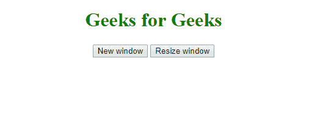
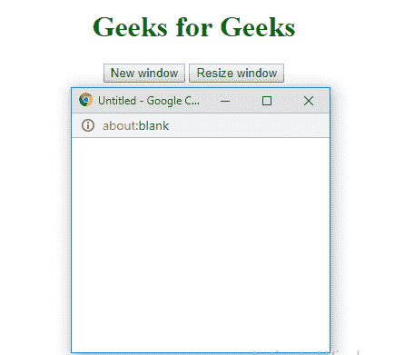

# HTML | Window resizeTo()方法

> 原文:[https://www.geeksforgeeks.org/html-window-resizeto-method/](https://www.geeksforgeeks.org/html-window-resizeto-method/)

**resizeTo()方法**用于*将窗口调整到指定的宽度和高度*。

**语法:**

```html
window.resizeTo(width, height)
```

**参数值:**

*   **宽度:**设置窗口的宽度，以像素为单位。
*   **高度:**设置窗口的高度，以像素为单位。

**示例:**调整窗口大小。

```html
<!DOCTYPE html>
<html>

<head>
    <title>
        Window resizeTo() Method
    </title>
    <style>
        h1 {
            color: green;
        }
    </style>

</head>

<body>
    <center>
        <h1>Geeks for Geeks</h1>
        <button onclick="openWin()">
            New window
        </button>
        <button onclick="resizeWin()">
            Resize window
        </button>

        <script>
            var myWindow;

            function openWin() {
                myWindow =
                    window.open("", "",
                        "width=100, height=100");
            }

            function resizeWin() {
                myWindow.resizeTo(300, 300);
                myWindow.focus();
            }
        </script>
    </center>
</body>

</html>
```

**输出:**
**初始:**

**新建窗口:**

**调整窗口大小:**


**支持的浏览器:**以下是 *Window resizeTo()方法*支持的浏览器:

*   谷歌 Chrome
*   微软公司出品的 web 浏览器
*   Mozilla Firefox
*   歌剧
*   旅行队