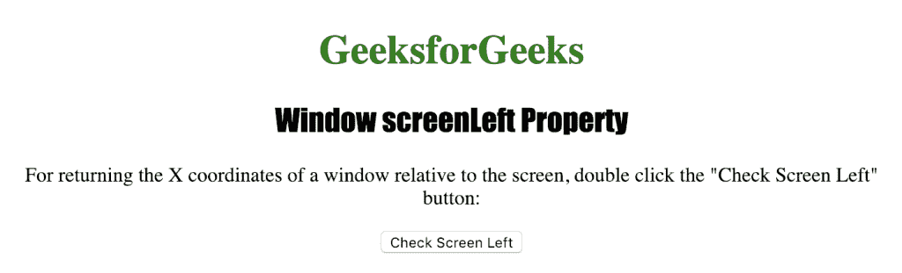
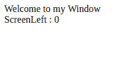

# HTML |窗口屏幕左侧属性

> 原文:[https://www . geesforgeks . org/html-window-screen left-property/](https://www.geeksforgeeks.org/html-window-screenleft-property/)

**窗口屏幕左侧属性**用于返回窗口相对于屏幕的“x”或水平坐标。它返回一个数字，代表窗口相对于屏幕的水平坐标。

**语法:**

```html
window.screenLeft
```

**返回值:**返回一个数字，表示窗口相对于屏幕的水平距离，以像素为单位

下面的程序说明了窗口屏幕左侧属性:

**获取窗口相对于屏幕的水平坐标。**

```html
<!DOCTYPE html>
<html>

<head>
    <title>
    Window screenLeft Property in HTML
    </title>
    <style>
        h1 {
            color: green;
        }

        h2 {
            font-family: Impact;
        }

        body {
            text-align: center;
        }
    </style>
</head>

<body>

    <h1>GeeksforGeeks</h1>
    <h2>Window screenLeft Property</h2>

    <p>
    For returning the X coordinates of
    a window relative to the screen,
    double click the "Check Screen 
    Left" button: 
    </p>

    <button ondblclick="coordinate()">
    Check Screen Left
    </button>

    <script>
        function coordinate() {
            var x = window.open("", "myWindow");
            x.document.write
                    ("<p>Welcome to my Window");
            x.document.write
             ("<br> ScreenLeft : " + x.screenLeft);
        }
    </script>

</body>

</html>                    
```

**输出:**


**点击**
按钮后

**支持的浏览器:***窗口左侧属性*支持的浏览器如下:

*   谷歌 Chrome
*   微软公司出品的 web 浏览器
*   歌剧
*   旅行队