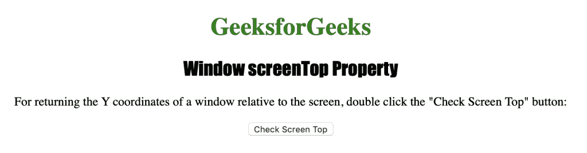
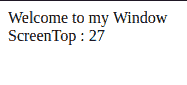

# HTML |窗口屏幕顶部属性

> 原文:[https://www . geesforgeks . org/html-window-screentop-property/](https://www.geeksforgeeks.org/html-window-screentop-property/)

**窗口屏幕顶部属性**用于返回窗口相对于屏幕的“y”或垂直坐标。它返回一个数字，代表窗口相对于屏幕的垂直坐标。
**语法:**

```html
window.screenTop
```

**返回值:返回一个**数字，表示窗口相对于屏幕的水平和垂直距离，以像素为单位

下面的程序说明了窗口屏幕顶部属性:
**获取窗口相对于屏幕的垂直坐标。**T3】

## 超文本标记语言

```html
<!DOCTYPE html>
<html>

<head>
    <title>
      Window screenTop Property in HTML
    </title>
    <style>
        h1 {
            color: green;
        }

        h2 {
            font-family: Impact;
        }

        body {
            text-align: center;
        }
    </style>
</head>

<body>

    <h1>GeeksforGeeks</h1>
    <h2>Window screenTop  Property</h2>

<p>
      For returning the Y coordinates of a
      window relative to the screen, double
      click the "Check Screen Top" button:
    </p>

    <button ondblclick="coordinate()">
      Check Screen Top
    </button>

    <script>
        function coordinate() {
            var y = window.open("", "myWindow");
            y.document.write
                    ("
<p>Welcome to my Window");
            y.document.write
            ("<br> ScreenTop : " + y.screenTop);
        }
    </script>

</body>

</html>
```

**输出:**



**点击**按钮后



**支持的浏览器:***窗口屏幕顶部属性*支持的浏览器如下:

*   谷歌 Chrome
*   微软公司出品的 web 浏览器
*   歌剧
*   旅行队