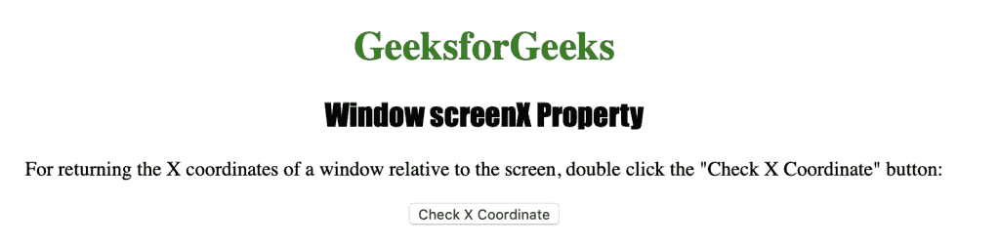
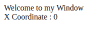

# HTML |窗口屏幕属性

> 原文:[https://www.geeksforgeeks.org/html-window-screenx-property/](https://www.geeksforgeeks.org/html-window-screenx-property/)

**窗口屏幕属性**用于返回窗口相对于屏幕的“x”或水平坐标。它返回一个数字，表示窗口相对于屏幕的水平距离(以像素为单位)。
**语法:**

```html
window.screenX
```

**返回值:**返回一个数字，表示窗口相对于屏幕的水平距离，以像素为单位

下面的程序说明了 window.screenX 属性:
**检查窗口相对于屏幕的 X 坐标。**T3】

## 超文本标记语言

```html
<!DOCTYPE html>
<html>

<head>
    <title>
      Window screenX Property in HTML
    </title>
    <style>
        h1 {
            color: green;
        }

        h2 {
            font-family: Impact;
        }

        body {
            text-align: center;
        }
    </style>
</head>

<body>

    <h1>GeeksforGeeks</h1>
    <h2>Window screenX  Property</h2>

<p>
      For returning the X coordinates of a window
      relative to the screen, double click the
      "Check X Coordinate" button:
    </p>

    <button ondblclick="coordinate()">
      Check X Coordinate
    </button>

    <script>
        function coordinate() {
            var x = window.open("", "myWindow");
            x.document.write
                    ("
<p>Welcome to my Window");
            x.document.write
            ("<br> X Coordinate : " + x.screenX + "</p>
");
        }
    </script>

</body>

</html>
```

**输出:**



**点击**按钮后



**支持的浏览器:**窗口屏幕属性支持的浏览器如下:

*   谷歌 Chrome
*   微软公司出品的 web 浏览器
*   火狐浏览器
*   歌剧
*   旅行队