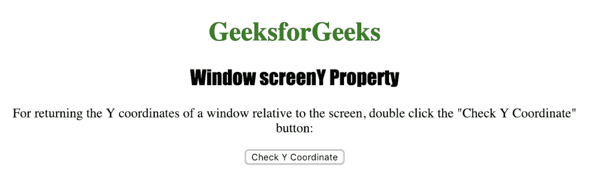
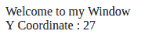

# HTML |窗口屏幕属性

> 原文:[https://www.geeksforgeeks.org/html-window-screeny-property/](https://www.geeksforgeeks.org/html-window-screeny-property/)

**窗口屏幕属性**用于返回窗口相对于屏幕的“y”或垂直坐标。它返回一个数字，表示窗口相对于屏幕的垂直距离，以像素为单位。

**语法:**

```html
window.screenY
```

下面的程序说明了 window.screenY 属性:

**检查窗口相对于屏幕的 Y 坐标。**

```html
<!DOCTYPE html>
<html>

<head>
    <title>
      Window screenY Property in HTML
    </title>
    <style>
        h1 {
            color: green;
        }

        h2 {
            font-family: Impact;
        }

        body {
            text-align: center;
        }
    </style>
</head>

<body>

    <h1>GeeksforGeeks</h1>
    <h2>Window screenY  Property</h2>

    <p>
      For returning the Y coordinates of a window 
      relative to the screen, double click the "Check 
      Y Coordinate" button: 
    </p>

    <button ondblclick="coordinate()">
      Check Y Coordinate
    </button>

    <script>
        function coordinate() {
            var Y = window.open("", "myWindow");
            Y.document.write
                    ("<p>Welcome to my Window");
            Y.document.write
            ("<br>Y Coordinate : " + Y.screenY + "</p>");
        }
    </script>

</body>

</html>                   
```

**输出:**


**点击**
按钮后

**支持的浏览器:***窗口屏幕属性*支持的浏览器如下:

*   谷歌 Chrome
*   微软公司出品的 web 浏览器
*   火狐浏览器
*   歌剧
*   旅行队