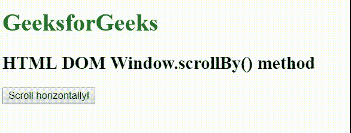
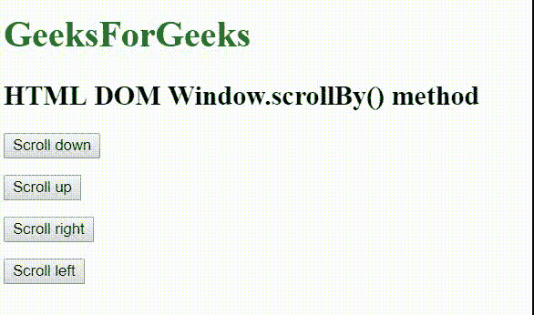

# HTML |窗口滚动比()方法

> 原文:[https://www.geeksforgeeks.org/html-window-scrollby-method/](https://www.geeksforgeeks.org/html-window-scrollby-method/)

**window.scrollBy()** 方法用于*按照给定的像素数滚动*文档。

**语法:**

```html
window.scrollBy( *xcoordinate*, *ycoordinate* );
```

或者

```html
window.scrollBy(*options*);
```

**参数:**该方法接受两个参数，如上所述，如下所述:

*   **x 坐标:**它是水平像素值，表示您想要滚动文档的程度(以像素为单位)。
*   **y 坐标:**它是垂直像素值，表示您想要滚动文档的程度(以像素为单位)。

**注意:**可以在*滚动选项*字典的选项中找到这些选项。

**例 1:水平滚动**

```html
<!DOCTYPE html>
<html>

<head>
    <title>
        HTML | DOM window scrollby() method
    </title>

    <style>
        body {
            width: 5000px;
        }
        a:focus {
            background-color: magenta;
        }
        button {
            position: fixed;
        }
    </style>
</head>

<body>
    <h1 style="color:green;"> 
        GeeksforGeeks 
    </h1>

    <h2>HTML DOM Window.scrollBy() method</h2>

    <button onclick="scrollby()">
        Scroll horizontally!
    </button>

    <br><br>

    <script>
        function scrollby() {
            window.scrollBy(100, 0);
        }
    </script>
</body>

</html>
```

**输出:**


**示例 2:使用选项**

```html
<!DOCTYPE html>
<html>

<head>
    <title>
        HTML | DOM Window scrollBy() method
    </title>

    <style>
        body {
            width: 5000px;
            height:5000px;
        }
        a:focus {
            background-color: magenta;
        }
        button {
            position: fixed;
        }
    </style>
</head>

<body>
    <h1 style="color:green;"> 
        GeeksForGeeks 
    </h1>

    <h2>HTML DOM Window.scrollBy() method</h2>

    <div>
        <button onclick="scrollWin(0, 50)">
            Scroll down
        </button>

        <br><br>

        <button onclick="scrollWin(0, -50)">
            Scroll up
        </button>

        <br><br>

        <button onclick="scrollWin(50, 0)">
            Scroll right
        </button>

        <br><br>

        <button onclick="scrollWin(-50, 0)">
            Scroll left
        </button>
    </div>

    <script>
        function scrollWin(x, y) {
            window.scrollBy(x, y);
        }
    </script>
</body>

</html>                    
```

**输出:**


**支持的浏览器:**以下是 *HTML DOM Window scrollBy()方法*支持的浏览器:

*   谷歌 Chrome 45
*   火狐浏览器
*   歌剧 32