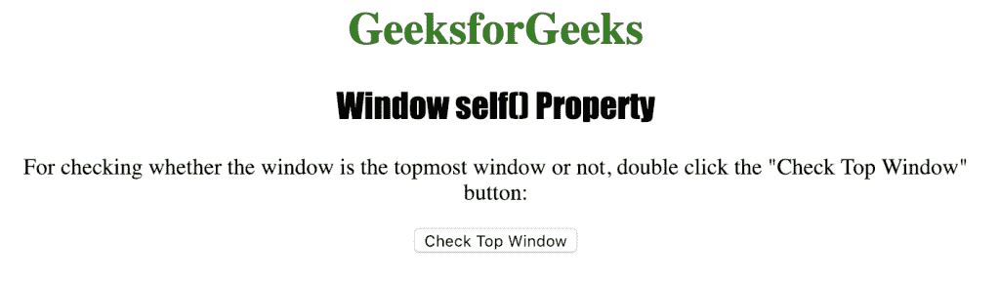
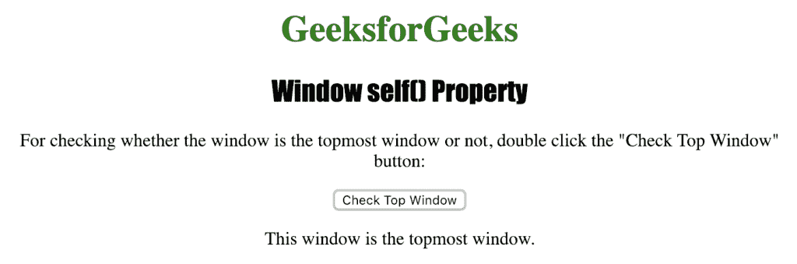

# HTML |窗口自身( )属性

> 原文:[https://www.geeksforgeeks.org/html-window-self-property/](https://www.geeksforgeeks.org/html-window-self-property/)

**窗口自身()属性**用于返回当前窗口。它通常用于比较目的，同时使用其他功能，如 top()。
这是一个只读属性，它返回对窗口对象本身的引用。
**语法:**

```html
window.self
```

**返回值:**返回窗口对象的引用。**T3】**

下面的程序举例说明了 Window self()属性:
**使用 Window self()属性与 window top()属性进行比较。**T3】

## 超文本标记语言

```html
<!DOCTYPE>
<html>

<head>
    <title>
      Window self() property in HTML
    </title>
    <style>
        h1 {
            color: green;
        }

        h2 {
            font-family: Impact;
        }

        body {
            text-align: center;
        }
    </style>
</head>

<body>

    <h1>GeeksforGeeks</h1>
    <h2>Window self() Property</h2>

<p>
      For checking whether the window is the topmost
      window or not, double click the "Check Top Window"
      button: </p>

    <button ondblclick="Window()">
      Check Top Window
    </button>

    <p id="MyWindow"></p>

    <script>
        function Window() {
            if (window.top = window.self) {
                document.getElementById("MyWindow").innerHTML =
                    "This window is the topmost window.";
            } else {
                document.getElementById("demo").innerHTML =
                    "This window is not the topmost window.";
            }
        }
    </script>
</body>

</html>
```

**输出:**



**点击**按钮后



**支持的浏览器:***Window self()属性*支持的浏览器如下:

*   谷歌 Chrome
*   微软公司出品的 web 浏览器
*   火狐浏览器
*   歌剧
*   旅行队