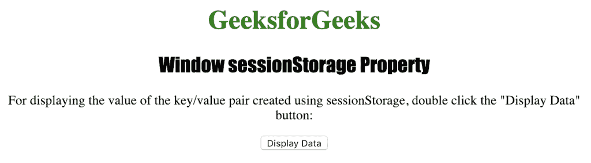
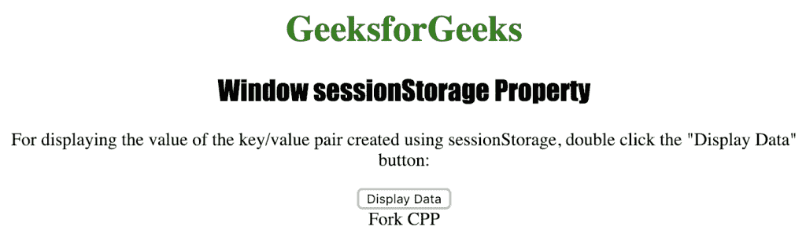

# HTML |窗口会话存储( )属性

> 原文:[https://www . geeksforgeeks . org/html-window-session storage-property/](https://www.geeksforgeeks.org/html-window-sessionstorage-property/)

**窗口会话存储()属性**用于在网络浏览器中保存键/值对。它只为一个会话在浏览器中存储键/值对，一旦加载新会话，数据就会过期。
**语法:**

```html
window.sessionStorage
```

**返回类型:**返回存储对象

下面的程序说明了 Window sessionStorage()属性:
**创建一个 sessionStorage 名称/值对。**T3】

## 超文本标记语言

```html
<!DOCTYPE>
<html>

<head>
    <title>
      Window sessionStorage property in HTML
    </title>
    <style>
        h1 {
            color: green;
        }

        h2 {
            font-family: Impact;
        }

        body {
            text-align: center;
        }
    </style>
</head>

<body>

    <h1>GeeksforGeeks</h1>
    <h2>Window sessionStorage Property</h2>

<p>
      For displaying the value of the key/value
      pair created using sessionStorage, double
      click the "Display Data" button:
    </p>

    <button ondblclick="Storage()">
      Display Data
    </button>

    <div id="myID"></div>

    <script>
        function Storage() {
            if (typeof(Storage) !== "undefined") {
                sessionStorage.setItem("course", "Fork CPP");
                document.getElementById("myID").innerHTML =
                    sessionStorage.getItem("course");
            } else {
                document.getElementById("myID").innerHTML =
                    "The browser does not support Web Storage.";
            }
        }
    </script>
</body>

</html>
```

**输出:**



**点击**按钮后



**支持的浏览器:**窗口会话存储( )属性支持的浏览器如下:

*   谷歌 Chrome
*   微软公司出品的 web 浏览器
*   火狐浏览器
*   歌剧
*   旅行队