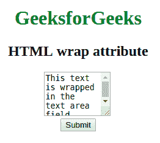

# HTML |包装属性

> 原文:[https://www.geeksforgeeks.org/html-wrap-attribute/](https://www.geeksforgeeks.org/html-wrap-attribute/)

**换行属性**用于*指定提交表单时文本在文本区域中的换行方式*。
包裹属性可以应用于 **<文本区域>** 元素:

**支持的标签:**

*   [**<>**](https://www.geeksforgeeks.org/html-textarea-tag/)

**属性值:**

*   **soft:** 指定提交表单后不会包装文本区域中的文本。
*   **硬:**指定提交表单时文本区域中的文本换行。

**示例:**展示包裹属性的工作。

## 超文本标记语言

```html
<!DOCTYPE html>
<html>

<head>
    <title>
        HTML wrap attribute
    </title>
</head>

<body style="text-align:center">
    <h1 style="color: green;">
      GeeksforGeeks
  </h1>
    <h2>
      HTML wrap attribute
  </h2>

    <!-- Assigning id to textarea. -->
    <textarea id="GFG_ID"
              rows="3"
              cols="10"
              name="Geeks"
              wrap="hard">
        This text is wrapped in
      the text area field.
    </textarea>
    <br>

    <button onclick="myGeeks()">
        Submit
    </button>
</body>

</html>
```

**输出:**



**支持的浏览器:**

*   火狐浏览器
*   铬
*   旅行队
*   微软公司出品的 web 浏览器
*   歌剧