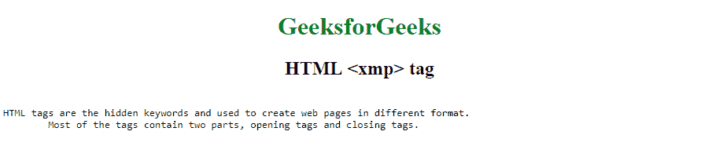

# HTML | xmp tag

> 原文：[https://www.geeksforgeeks.org/html-xmp-tag/](https://www.geeksforgeeks.org/html-xmp-tag/)

The **<xmp>** tag is used to create any content as letter format. Any text content between this <xmp> tag will display as the user type in the code section, same width, same position ending everything will be displayed as a replica of typed format or style.

**Syntax:**

```html
<xmp> statement </xmp>
```

**Attribute:** This tag does not contain any attribute.

**Example:**

```html
<!DOCTYPE html>
<html>

<head>
    <title>HTML <xmp> Tag</title>
    <style>
        h1 {
            color: green;
        }
    </style>
</head>

<body>
    <center>
        <h1>GeeksforGeeks</h1>
        <h2>HTML <xmp> tag</h2>
    </center>
    <xmp>
HTML tags are hidden keywords and used to create web pages in different format. 
      Most of the tags contain two parts, opening tags and closing tags.
    </xmp>

</body>

</html>
```

**Output:**


**Supported Browsers:** The browsers supported by **HTML <xmp> tag** are listed below:

*   Google Chrome
*   Internet Explorer
*   Firefox
*   Safari
*   Opera