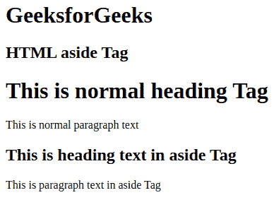
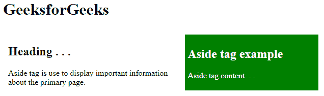

# HTML5

<aside>标签</aside>

> 原文:[https://www.geeksforgeeks.org/html5-aside-tag/](https://www.geeksforgeeks.org/html5-aside-tag/)

<aside>标签用于像荧光笔一样，以较短的方式描述网页的主要对象。它基本上识别与网页的主要内容相关的内容，但不构成主要页面的主要意图。

<aside>标签主要包含作者信息、链接、相关内容等。</aside>

</aside>

**<一旁> vs < div > :** 两个标签行为相同，含义不同。

*   [**<div>**](https://www.geeksforgeeks.org/div-tag-html/)**:**在网页中定义或创建分部或版块。
*   **<一旁> :** 它通过创建一个部分或分部来做同样的工作，但是它只包含与主网页相关的内容。

<aside>标签使页面设计变得容易，并且增强了 HTML 文档的清晰度。它让我们很容易识别主文本和从属文本。在和

<aside>都需要 CSS 来具体设计。

<aside>标签支持 HTML 中的**全局属性**和**事件属性**。</aside>

</aside>

</aside>

**注意:**旁边的<>标签在 HTML5 中是新的。这个标签在浏览器中并不表现为任何特殊的东西，你必须使用 CSS。

**语法:**

```html
<aside>
  <h1>Contents...</h1>
  <p>Contents...</p>
</aside>
```

**示例:**除标签外的 HTML

## 超文本标记语言

```html
<html>
<body>
    <h1>GeeksforGeeks</h1>
    <h2>HTML aside Tag</h2>
    <h1>This is normal heading Tag</h1>

    <p>This is normal paragraph text</p>

    <aside>
      <h1>This is heading text in aside Tag</h1>

      <p>This is paragraph text in aside Tag</p>
    </aside>
</body>
</html>
```

**输出:**



**示例:**在 HTML 中使用样式除了标签:

## 超文本标记语言

```html
<html>
<head>
  <style>
    article {
      width: 50%;
      padding: 10px;
      float: left;
    }
    aside {
      width: 40%;
      float: right;
      background-color: green;
      color: white;
      padding: 5px;
      margin: 10px;
      height: 100px;
    }
  </style>
</head>
<body>
  <h1>GeeksforGeeks</h1>
  <article>
    <h1>Heading . . .</h1>
    <p>
      Aside tag is use to display important 
      information about the primary page.
    </p>
  </article>
  <aside>
    <h1>Aside tag example</h1>
    <p>Aside tag content. . .</p>
  </aside>
</body>
</html>
```

**输出:** 

**支持的浏览器:**

*   谷歌 Chrome 6.0 及以上版本
*   Internet Explorer 9.0 及以上版本
*   Firefox 4.0 及以上版本
*   Opera 11.1 及以上
*   Safari 5.0 及以上版本